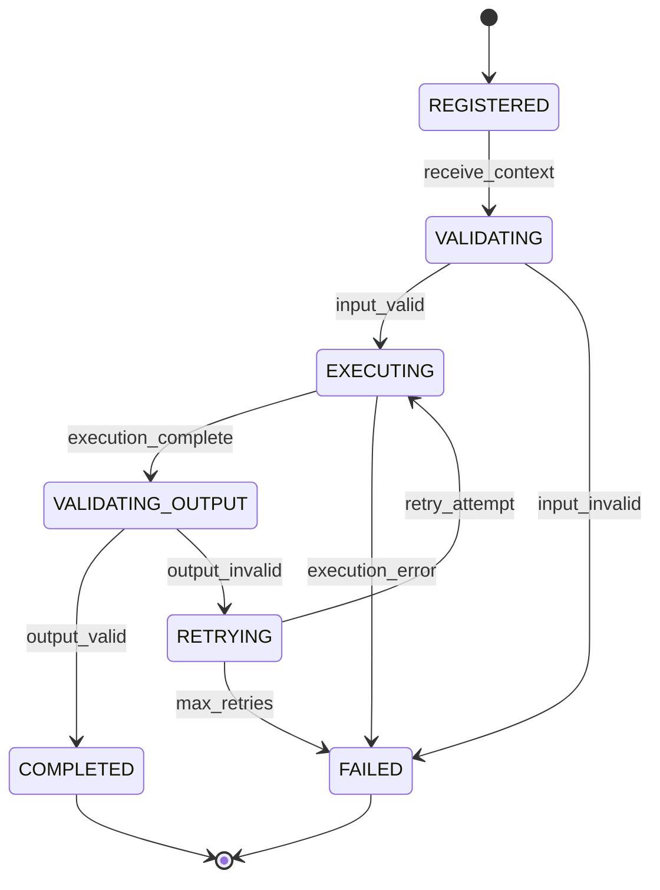

# AICF v2 Agent Lifecycle

## Overview

This document describes the complete lifecycle of an AI agent execution within the AICF v2 workflow system.

---

## Lifecycle Stages



---

## Stage Details

### 1. Registration

**When**: System startup or lazy loading

**Actions:**
- Agent class instantiated
- Registered in AgentRegistry
- Capabilities documented

```python
registry = AgentRegistry()
registry.register("idea", MockIdeaAgent())
```

### 2. Context Reception

**When**: Workflow engine calls execute_stage()

**Actions:**
- Build AgentContext with episode data
- Gather previous stage outputs
- Include custom instructions

### 3. Input Validation

**When**: Before execution

**Validation Checks:**
- Episode exists and is accessible
- Channel profile available
- Required previous outputs present
- Organization ID valid

### 4. Execution

**When**: After successful validation

**Actions:**
- Call agent.execute(context)
- Track start time
- Monitor token usage
- Handle exceptions

```python
start_time = time.time()
try:
    result = agent.execute(context)
    execution_time = time.time() - start_time
except Exception as e:
    result = AgentResult(success=False, error_message=str(e))
```

### 5. Output Validation

**When**: After execution completes

**Validation Checks:**
- Output structure matches contract
- Required fields present
- Data types correct
- Business rules satisfied

### 6. Result Recording

**When**: After successful validation

**Actions:**
- Update ContentJob status
- Create/update AgentExecution record
- Store output in database
- Calculate costs

### 7. Error Handling

**On Failure:**
- Log error details
- Increment retry count
- Determine if retry possible
- Update status to FAILED or RETRYING

---

## Retry Lifecycle

### Retry Decision

```python
def should_retry(execution: AgentExecution, max_retries: int) -> bool:
    if execution.retry_count >= max_retries:
        return False
    
    # Don't retry validation errors
    if "validation" in execution.error_message.lower():
        return False
    
    return True
```

### Retry Execution

```python
def retry_execution(episode, stage_type):
    execution = get_latest_execution(episode, stage_type)
    execution.retry_count += 1
    execution.status = AgentExecutionStatus.RETRYING
    
    # Re-execute with same context
    return execute_stage(episode, stage_type)
```

---

## State Transitions

| From | To | Trigger |
|------|-----|---------|
| REGISTERED | VALIDATING | Context received |
| VALIDATING | EXECUTING | Input valid |
| VALIDATING | FAILED | Input invalid |
| EXECUTING | VALIDATING_OUTPUT | Execution complete |
| EXECUTING | FAILED | Exception raised |
| VALIDATING_OUTPUT | COMPLETED | Output valid |
| VALIDATING_OUTPUT | RETRYING | Output invalid |
| RETRYING | EXECUTING | Retry attempt |
| RETRYING | FAILED | Max retries exceeded |
| COMPLETED | [*] | Lifecycle end |
| FAILED | [*] | Lifecycle end |

---

## Document Information

- **Version**: 2.0
- **Last Updated**: 2024
- **Author**: AICF Engineering Team
- **Status**: Active Development
