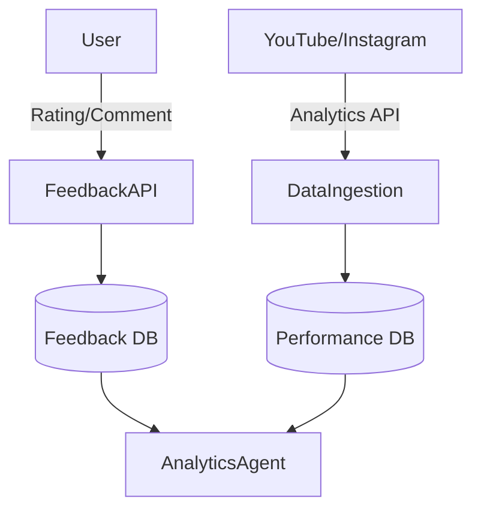

# AICF v2 Future AI Evolution

## Overview

This document outlines the planned AI evolution roadmap for AICF v2, including feedback systems, analytics, and intelligent recommendations.

---

## Phase 8: Feedback Collection

### Feedback System Architecture



### Feedback Types

| Type | Source | Format |
|------|--------|--------|
| Explicit Rating | User | 1-5 stars |
| Qualitative Feedback | User | Text comments |
| Engagement Metrics | Platforms | Views, likes, shares |
| Retention Data | Platforms | Watch time, drop-off |
| A/B Test Results | System | Variant performance |

### Implementation Plan

```python
class FeedbackCollector:
    def collect_explicit(self, user_id: str, episode_id: int, rating: int, comment: str):
        feedback = Feedback(
            user_id=user_id,
            episode_id=episode_id,
            type="explicit",
            rating=rating,
            comment=comment
        )
        self.db.add(feedback)
    
    def collect_implicit(self, episode_id: int, platform_metrics: Dict):
        performance = ContentPerformance(
            episode_id=episode_id,
            views=platform_metrics["views"],
            engagement_rate=platform_metrics["engagement"],
            retention_rate=platform_metrics["retention"]
        )
        self.db.add(performance)
```

---

## Phase 8: Content Performance Analysis

### Analytics Agent

**Purpose**: Analyze content performance and generate insights.

**Input:**
- Episode metadata
- Platform analytics
- User feedback
- Historical data

**Output:**
```python
{
    "episode_id": 123,
    "performance_score": 85,
    "strengths": ["high_retention", "strong_hook"],
    "weaknesses": ["low_ctr"],
    "recommendations": [
        "Improve thumbnail design",
        "Shorten intro sequence"
    ],
    "comparison_to_average": "+15%"
}
```

### Key Metrics

| Metric | Calculation | Target |
|--------|-------------|--------|
| Performance Score | Weighted avg of all metrics | >75 |
| Engagement Rate | (likes+comments)/views * 100 | >5% |
| Retention Rate | Avg watch time / duration * 100 | >60% |
| CTR | Clicks / impressions * 100 | >8% |

---

## Phase 9: Recommendation Engine

### Architecture

```
Content Features → Embedding Model → Vector Store
     ↓                                    ↓
User Preferences → Matching Algorithm → Recommendations
```

### Recommendation Types

1. **Content Ideas**: Suggest new episode topics
2. **Style Adjustments**: Recommend visual/audio changes
3. **Publishing Optimization**: Best times and platforms
4. **Playlist Organization**: Group related episodes

### Implementation

```python
class RecommendationEngine:
    def recommend_topics(self, channel_id: int, count: int = 10) -> List[Dict]:
        # Get channel's successful topics
        successful = self._get_successful_topics(channel_id)
        
        # Find trending related topics
        trending = self._find_trending_topics(successful)
        
        # Rank by relevance and trend score
        ranked = self._rank_recommendations(trending)
        
        return ranked[:count]
```

---

## Phase 9: User Preference Learning

### Learning Methods

**Explicit:**
- Direct ratings
- Preference settings
- Manual adjustments

**Implicit:**
- Content selection patterns
- Edit frequency
- Time spent reviewing

### Preference Model

```python
class PreferenceLearner:
    def update_preferences(self, user_id: str, interaction: Interaction):
        # Extract features
        features = self._extract_features(interaction)
        
        # Update preference vectors
        current = self._get_user_vector(user_id)
        updated = self._blend_vectors(current, features, learning_rate=0.1)
        
        # Store updated preferences
        self._store_preferences(user_id, updated)
```

---

## Phase 9: Brand Memory Enhancement

### Vector-Based Brand Storage

```python
class BrandMemorySystem:
    def store_brand_element(self, channel_id: int, element: BrandElement):
        embedding = self.embedder.encode(element.text)
        
        self.vector_db.upsert(
            index=f"brand_{channel_id}",
            id=element.id,
            vector=embedding,
            metadata={
                "type": element.type,
                "text": element.text,
                "created_at": datetime.now()
            }
        )
    
    def retrieve_relevant_guidelines(self, channel_id: int, context: str) -> List[str]:
        query_embedding = self.embedder.encode(context)
        
        results = self.vector_db.search(
            index=f"brand_{channel_id}",
            vector=query_embedding,
            top_k=5
        )
        
        return [r.metadata["text"] for r in results]
```

---

## Phase 9: Content Intelligence

### Scoring System

```python
class ContentIntelligence:
    def calculate_quality_score(self, episode: Episode) -> float:
        factors = {
            "script_quality": self._assess_script(episode),
            "visual_consistency": self._check_brand_alignment(episode),
            "seo_optimization": self._evaluate_seo(episode),
            "engagement_prediction": self._predict_engagement(episode)
        }
        
        weights = {
            "script_quality": 0.3,
            "visual_consistency": 0.25,
            "seo_optimization": 0.2,
            "engagement_prediction": 0.25
        }
        
        return sum(factors[k] * weights[k] for k in factors)
```

### Predictive Analytics

```python
class PerformancePredictor:
    def predict_performance(self, episode_features: Dict) -> Prediction:
        model = self.load_model("performance_predictor_v1")
        
        prediction = model.predict([episode_features])[0]
        
        return Prediction(
            expected_views=prediction["views"],
            expected_engagement=prediction["engagement"],
            confidence_interval=prediction["ci"],
            similar_episodes=prediction["similar"]
        )
```

---

## Integration Points

### With Workflow Engine

```python
class IntelligentWorkflowEngine(WorkflowEngineV2):
    def execute_stage(self, episode, stage_type, custom_instructions=None):
        # Retrieve relevant brand memories
        brand_context = self.brand_memory.retrieve(
            episode.channel_profile_id,
            f"{stage_type.value} guidelines"
        )
        
        # Get user preferences
        user_prefs = self.preference_store.get(episode.organization_id)
        
        # Augment context
        augmented_instructions = self._augment_with_intelligence(
            custom_instructions,
            brand_context,
            user_prefs
        )
        
        return super().execute_stage(episode, stage_type, augmented_instructions)
```

---

## Document Information

- **Version**: 2.0
- **Last Updated**: 2024
- **Author**: AICF Engineering Team
- **Status**: Planned (Phases 8-9)
