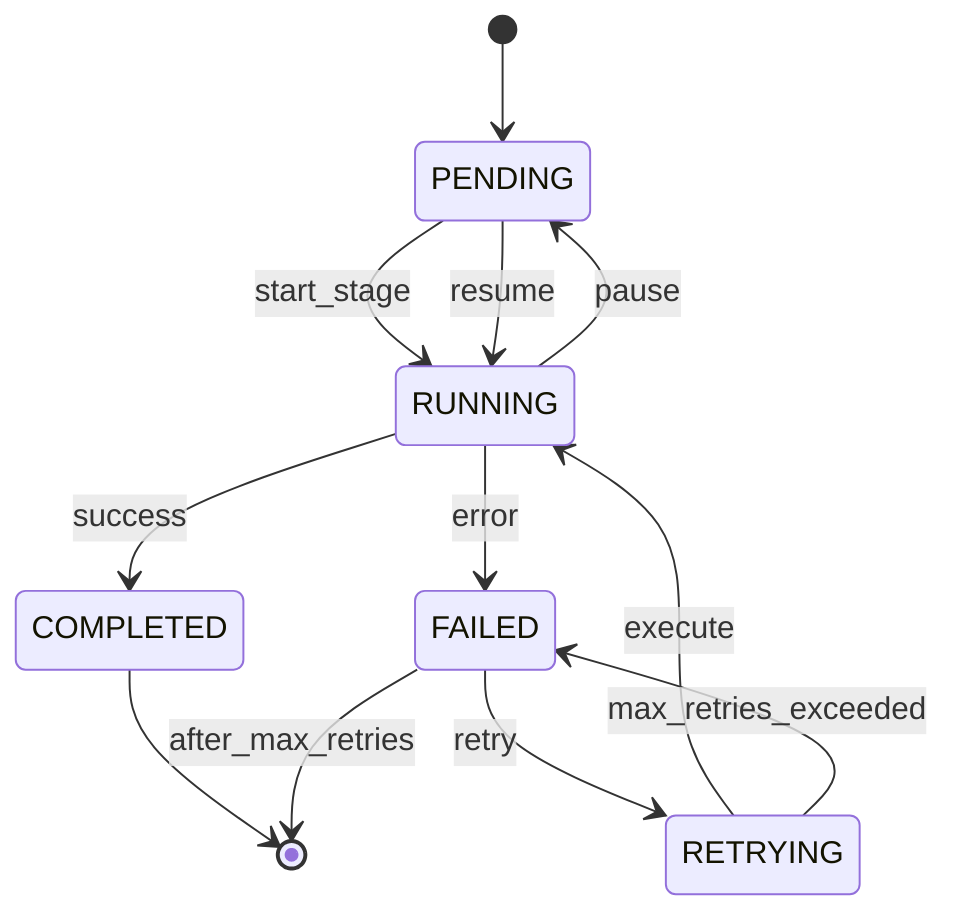

# AICF v2 Backend Architecture

## Overview

This document details the backend architecture of AICF v2, including component design, data flow, and implementation patterns.

---

## Application Layers

### 1. API Layer (FastAPI)

**Purpose**: Handle HTTP requests/responses, authentication, validation

**Components:**
- `app/main.py` - Application entry point
- `app/api/routes.py` - Route definitions
- `app/api/schemas.py` - Pydantic models for validation
- `app/api/pagination.py` - Pagination utilities
- `app/api/responses.py` - Standardized response formats

**Key Patterns:**
```python
# Dependency injection for database session
def get_db():
    db = SessionLocal()
    try:
        yield db
    finally:
        db.close()

# JWT dependency for authentication
def get_current_user(token: str = Depends(oauth2_scheme)) -> User:
    payload = jwt.decode(token, SECRET_KEY, algorithms=[ALGORITHM])
    user = db.query(User).get(payload["sub"])
    return user

# Tenant isolation middleware
class TenantIsolationMiddleware:
    def __call__(self, request, call_next):
        user = get_current_user_from_request(request)
        request.state.organization_id = user.organization_id
        response = call_next(request)
        return response
```

---

### 2. Service Layer

**Purpose**: Business logic orchestration, transaction management

**Services:**
- `services/workflow_service.py` - Workflow orchestration
- `services/channel_service.py` - Channel profile management
- `services/playlist_service.py` - Playlist operations
- `services/episode_service.py` - Episode lifecycle
- `services/organization_service.py` - Organization management
- `services/user_service.py` - User operations
- `services/asset_service.py` - Asset management

**Service Pattern:**
```python
class WorkflowService:
    def __init__(self, db: Session, registry: AgentRegistry):
        self.db = db
        self.registry = registry
        self.engine = WorkflowEngineV2(db)
    
    def create_workflow(self, episode_id: int, organization_id: int) -> Dict:
        # Validate tenant isolation
        episode = self._get_episode(episode_id, organization_id)
        
        # Create workflow
        workflow_job = self.engine.start_episode_workflow(episode)
        
        # Return structured response
        return {
            "workflow_id": workflow_job.id,
            "status": workflow_job.status.value,
            "stages_created": len(WorkflowStageType.get_stage_order())
        }
```

---

### 3. Domain Layer

**Purpose**: Core business entities and rules

**Modules:**
- `core/workflow/` - Workflow engine V2
- `agents/` - AI agent system
- `database/models.py` - SQLAlchemy ORM models

**Workflow Engine:**
```python
class WorkflowEngineV2:
    STAGE_ORDER = [
        WorkflowStageType.IDEA,
        WorkflowStageType.RESEARCH,
        WorkflowStageType.SCRIPT,
        WorkflowStageType.STORYBOARD,
        WorkflowStageType.ASSET_GENERATION,
        WorkflowStageType.VIDEO_PRODUCTION,
        WorkflowStageType.SEO,
        WorkflowStageType.PUBLISH
    ]
    
    def execute_stage(self, episode, stage_type, custom_instructions=None):
        # Get stage job
        stage_job = self._get_stage_job(episode, stage_type)
        
        # Get or create agent execution record
        agent_execution = self._get_agent_execution(stage_job)
        
        # Build context
        context = WorkflowContext(
            episode=episode,
            channel_profile=channel_profile,
            organization_id=episode.organization_id,
            previous_outputs=self._gather_previous_outputs(episode)
        )
        
        # Execute agent
        agent = self.agents.get(stage_type.value)
        result = agent.execute(context)
        
        # Update records
        self._update_execution_records(stage_job, agent_execution, result)
        
        return result
```

---

### 4. Data Access Layer

**Purpose**: Database operations, query optimization

**Implementation:**
- SQLAlchemy v2 ORM
- Alembic migrations
- Query optimization with indexes

**Model Pattern:**
```python
class TenantMixin:
    """Mixin for tenant-owned entities."""
    id = Column(Integer, primary_key=True)
    organization_id = Column(Integer, ForeignKey("organizations.id"), nullable=False, index=True)
    created_at = Column(DateTime, server_default=func.now())
    updated_at = Column(DateTime, onupdate=func.now())
    
    __table_args__ = (
        Index('idx_tenant_entity', 'organization_id', 'id'),
    )

class Episode(TenantMixin, Base):
    __tablename__ = "episodes"
    
    title = Column(String(500), nullable=False, index=True)
    status = Column(SQLEnum(EpisodeStatus), default=EpisodeStatus.PLANNED)
    playlist_id = Column(Integer, ForeignKey("playlists.id"), nullable=False)
    channel_profile_id = Column(Integer, ForeignKey("channel_profiles.id"), nullable=False)
    
    # Relationships
    playlist = relationship("Playlist", back_populates="episodes")
    channel_profile = relationship("ChannelProfile", back_populates="episodes")
    content_jobs = relationship("ContentJob", back_populates="episode")
    agent_executions = relationship("AgentExecution", back_populates="episode")
```

---

## Authentication Architecture

### JWT Token Structure

```python
# Access Token Payload
{
    "sub": "user_id",
    "email": "user@example.com",
    "organization_id": 1,
    "roles": ["member"],
    "permissions": ["channel:read", "episode:create"],
    "exp": 1704067200,  # 15 minutes
    "iat": 1704066300
}

# Refresh Token Payload
{
    "sub": "user_id",
    "type": "refresh",
    "exp": 1704671100,  # 7 days
    "iat": 1704066300
}
```

### Token Flow

```
Login Request → Verify Credentials → Generate Tokens → Return to Client
                      ↓
              Store refresh token hash in DB
                      ↓
Client stores tokens (access in memory, refresh in httpOnly cookie)

Subsequent Requests:
Client sends access token in Authorization header
      ↓
API validates signature and expiration
      ↓
Extract organization_id for tenant scoping
      ↓
Process request with tenant context
```

---

## RBAC Implementation

### Role Hierarchy

```
Owner (full access)
  └── Admin (manage users, channels, content)
      └── Manager (manage content, view analytics)
          └── Member (create/edit content)
              └── Viewer (read-only access)
```

### Permission Model

```python
# Built-in permissions
PERMISSIONS = {
    "organization": ["read", "update", "delete"],
    "team": ["create", "read", "update", "delete"],
    "channel": ["create", "read", "update", "delete", "publish"],
    "playlist": ["create", "read", "update", "delete"],
    "episode": ["create", "read", "update", "delete", "publish"],
    "workflow": ["create", "read", "update", "retry"],
    "user": ["create", "read", "update", "delete"]
}

# Role-permission mapping
ROLE_PERMISSIONS = {
    "owner": all_permissions,
    "admin": all_permissions_except_delete_org,
    "manager": ["channel:*", "playlist:*", "episode:*", "workflow:*"],
    "member": ["channel:read", "playlist:create", "episode:create"],
    "viewer": ["channel:read", "playlist:read", "episode:read"]
}
```

### Permission Check Decorator

```python
def require_permission(permission: str):
    def decorator(func):
        @functools.wraps(func)
        async def wrapper(request: Request, current_user: User = Depends(get_current_user)):
            if not has_permission(current_user, permission):
                raise HTTPException(status_code=403, detail="Insufficient permissions")
            return await func(request, current_user)
        return wrapper
    return decorator

# Usage
@app.get("/channels/{channel_id}")
@require_permission("channel:read")
async def get_channel(channel_id: int, current_user: User):
    ...
```

---

## Workflow Engine Deep Dive

### State Machine



### ContentJob States

| Status | Description | Next Action |
|--------|-------------|-------------|
| PENDING | Waiting to start | Start stage |
| QUEUED | In queue (future) | Execute when ready |
| RUNNING | Currently executing | Wait for completion |
| COMPLETED | Successfully finished | Move to next stage |
| FAILED | Execution failed | Retry or manual intervention |
| CANCELLED | Manually cancelled | None |
| RETRYING | Being retried | Execute again |

### AgentExecution Tracking

```python
class AgentExecution(Base):
    # Identification
    execution_id = Column(String(100), unique=True)  # UUID for tracing
    agent_name = Column(String(100), nullable=False)
    agent_type = Column(String(100))  # Matches stage type
    
    # Status
    status = Column(Enum(AgentExecutionStatus))
    
    # Timing
    started_at = Column(DateTime)
    completed_at = Column(DateTime)
    duration_seconds = Column(Float)
    
    # Results
    input_data = Column(JSON)
    output_data = Column(JSON)
    error_message = Column(Text)
    
    # Cost tracking
    prompt_tokens = Column(BigInteger)
    completion_tokens = Column(BigInteger)
    total_tokens = Column(BigInteger)
    
    # Retry info
    retry_count = Column(Integer, default=0)
    parent_execution_id = Column(Integer)  # Reference to previous attempt
```

---

## Error Handling Strategy

### Exception Hierarchy

```python
class WorkflowError(Exception):
    """Base workflow exception"""

class StageExecutionError(WorkflowError):
    """Stage execution failed"""

class StageNotFoundError(WorkflowError):
    """Stage not found"""

class WorkflowNotPausedError(WorkflowError):
    """Cannot resume - workflow not paused"""

class InvalidStageTransitionError(WorkflowError):
    """Invalid stage transition"""

class AgentExecutionError(WorkflowError):
    """Agent execution failed"""

class WorkflowValidationError(WorkflowError):
    """Validation failed"""
```

### Error Response Format

```json
{
    "error": {
        "code": "STAGE_EXECUTION_ERROR",
        "message": "Stage 'script' failed during execution",
        "details": {
            "stage_type": "script",
            "episode_id": 123,
            "error_type": "AgentExecutionError"
        },
        "trace_id": "abc123-def456",
        "timestamp": "2024-01-15T10:30:00Z"
    }
}
```

---

## Logging Strategy

### Log Levels

| Level | Usage |
|-------|-------|
| DEBUG | Detailed execution info |
| INFO | Normal operations |
| WARNING | Recoverable issues |
| ERROR | Operation failures |
| CRITICAL | System failures |

### Structured Logging

```python
import logging
import json

class JSONFormatter(logging.Formatter):
    def format(self, record):
        log_entry = {
            "timestamp": datetime.utcnow().isoformat(),
            "level": record.levelname,
            "logger": record.name,
            "message": record.getMessage(),
            "module": record.module,
            "function": record.funcName,
            "line": record.lineno
        }
        if hasattr(record, 'extra_data'):
            log_entry.update(record.extra_data)
        return json.dumps(log_entry)

# Usage
logger = logging.getLogger("workflow_v2")
logger.info("Stage executed", extra={
    "extra_data": {
        "stage_type": "script",
        "episode_id": 123,
        "duration_seconds": 2.5
    }
})
```

---

## Document Information

- **Version**: 2.0
- **Last Updated**: 2024
- **Author**: AICF Engineering Team
- **Status**: Active Development
