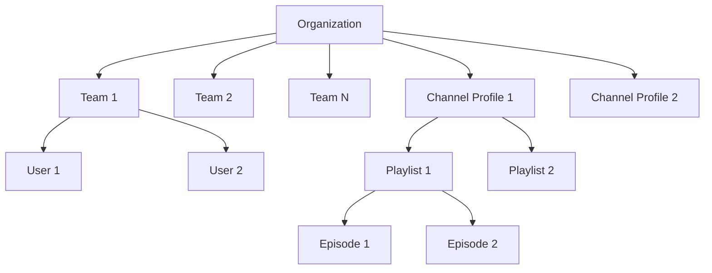

# AICF v2 Multi-Tenant Design

## Overview

AICF v2 implements a multi-tenant SaaS architecture where each organization (tenant) has complete data isolation while sharing the same application infrastructure.

---

## Tenant Model

### Organization Structure



### Key Entities

| Entity | Tenant Scope | Description |
|--------|-------------|-------------|
| Organization | Root | Top-level tenant entity |
| Team | Organization | Subdivision within org |
| User | Organization | Individual account |
| ChannelProfile | Organization | Brand identity |
| Playlist | Organization | Content collection |
| Episode | Organization | Individual content unit |
| ContentJob | Organization | Workflow job |
| AgentExecution | Organization | AI execution record |
| Asset | Organization | Generated media |

---

## Isolation Strategy

### Database-Level Isolation

**Strategy**: Shared database, shared schema, row-level isolation

```python
# Every tenant-owned model includes organization_id
class TenantMixin(Base):
    __abstract__ = True
    
    id = Column(Integer, primary_key=True)
    organization_id = Column(
        Integer, 
        ForeignKey("organizations.id"), 
        nullable=False, 
        index=True
    )
    created_at = Column(DateTime, server_default=func.now())
    
    # Composite index for efficient tenant-scoped queries
    __table_args__ = (
        Index('idx_tenant_entity', 'organization_id', 'id'),
    )
```

### Query Scoping Pattern

```python
class BaseService:
    def __init__(self, db: Session, organization_id: int):
        self.db = db
        self.organization_id = organization_id
    
    def _scoped_query(self, model):
        return self.db.query(model).filter(
            model.organization_id == self.organization_id
        )

class EpisodeService(BaseService):
    def get_episode(self, episode_id: int) -> Episode:
        return self._scoped_query(Episode).filter(
            Episode.id == episode_id
        ).first()
    
    def list_episodes(self, playlist_id: int) -> List[Episode]:
        return self._scoped_query(Episode).filter(
            Episode.playlist_id == playlist_id
        ).all()
```

---

## Tenant Context Propagation

### Authentication Flow

```python
# JWT contains organization_id
def create_access_token(user: User) -> str:
    to_encode = {
        "sub": str(user.id),
        "email": user.email,
        "organization_id": user.organization_id,  # Critical for isolation
        "roles": [r.name for r in user.roles],
        "exp": datetime.utcnow() + timedelta(minutes=15)
    }
    return jwt.encode(to_encode, SECRET_KEY, algorithm="HS256")
```

### Request Middleware

```python
@app.middleware("http")
async def tenant_isolation_middleware(request: Request, call_next):
    # Skip for public endpoints
    if request.url.path in ["/health", "/auth/login", "/auth/register"]:
        return await call_next(request)
    
    # Extract JWT
    auth_header = request.headers.get("Authorization")
    if not auth_header:
        raise HTTPException(status_code=401, detail="Missing authorization")
    
    token = auth_header.replace("Bearer ", "")
    try:
        payload = jwt.decode(token, SECRET_KEY, algorithms=["HS256"])
    except jwt.ExpiredSignatureError:
        raise HTTPException(status_code=401, detail="Token expired")
    
    # Attach tenant context to request
    request.state.organization_id = payload["organization_id"]
    request.state.user_id = payload["sub"]
    request.state.user_roles = payload.get("roles", [])
    
    response = await call_next(request)
    return response
```

### Service Layer Usage

```python
class WorkflowService:
    def __init__(self, db: Session, organization_id: int):
        self.db = db
        self.organization_id = organization_id
    
    def create_workflow(self, episode_id: int) -> Dict:
        # Validate episode belongs to this organization
        episode = self.db.query(Episode).filter(
            Episode.id == episode_id,
            Episode.organization_id == self.organization_id  # Tenant isolation
        ).first()
        
        if not episode:
            raise ValueError(f"Episode {episode_id} not found")
        
        # Create workflow with organization_id
        workflow_job = ContentJob(
            episode_id=episode_id,
            organization_id=self.organization_id,  # Always set
            job_type="workflow",
            status=ContentJobStatus.PENDING
        )
        
        self.db.add(workflow_job)
        self.db.commit()
        
        return {"workflow_id": workflow_job.id}
```

---

## Data Access Patterns

### Safe Pattern (Always Use)

```python
# Explicitly filter by organization_id
episodes = db.query(Episode).filter(
    Episode.organization_id == current_org_id,
    Episode.status == EpisodeStatus.PLANNED
).all()

# Or use relationship through tenant-scoped parent
playlist = db.query(Playlist).filter(
    Playlist.id == playlist_id,
    Playlist.organization_id == current_org_id
).first()
episodes = playlist.episodes  # Already scoped through relationship
```

### Unsafe Pattern (Never Use)

```python
# DANGEROUS: No organization_id filter!
episodes = db.query(Episode).filter(
    Episode.status == EpisodeStatus.PLANNED
).all()  # Could return episodes from ANY organization!
```

---

## Relationship Integrity

### Foreign Key Constraints

```python
class Episode(Base):
    __tablename__ = "episodes"
    
    id = Column(Integer, primary_key=True)
    organization_id = Column(Integer, ForeignKey("organizations.id"), nullable=False)
    playlist_id = Column(Integer, ForeignKey("playlists.id"), nullable=False)
    channel_profile_id = Column(Integer, ForeignKey("channel_profiles.id"), nullable=False)
    
    # Relationships ensure referential integrity
    playlist = relationship("Playlist", back_populates="episodes")
    channel_profile = relationship("ChannelProfile", back_populates="episodes")
```

### Cascading Deletes

```python
class Organization(Base):
    teams = relationship("Team", cascade="all, delete-orphan")
    channel_profiles = relationship("ChannelProfile", cascade="all, delete-orphan")
    playlists = relationship("Playlist", cascade="all, delete-orphan")
    episodes = relationship("Episode", cascade="all, delete-orphan")
    content_jobs = relationship("ContentJob", cascade="all, delete-orphan")
    agent_executions = relationship("AgentExecution", cascade="all, delete-orphan")
```

---

## Cross-Tenant Operations

### Prevented Operations

The following operations are explicitly prevented:

1. **Cross-org user access**: Users can only access their own organization's data
2. **Cross-org resource sharing**: Resources cannot be shared between organizations
3. **Cross-org workflow execution**: Workflows only process episodes within same org

### Future: Multi-Org Features

If cross-organization features are needed:

```python
class ResourceShare(Base):
    __tablename__ = "resource_shares"
    
    id = Column(Integer, primary_key=True)
    source_organization_id = Column(Integer, ForeignKey("organizations.id"))
    target_organization_id = Column(Integer, ForeignKey("organizations.id"))
    resource_type = Column(String(50))
    resource_id = Column(Integer)
    permissions = Column(JSON)
    
    # Explicit sharing requires both org IDs
    __table_args__ = (
        CheckConstraint('source_organization_id != target_organization_id'),
    )
```

---

## Performance Considerations

### Indexing Strategy

```python
# Composite indexes for common query patterns
__table_args__ = (
    Index('idx_org_status', 'organization_id', 'status'),
    Index('idx_org_created', 'organization_id', 'created_at'),
    Index('idx_org_playlist', 'organization_id', 'playlist_id'),
)
```

### Query Optimization

```python
# Use eager loading to prevent N+1 queries
episodes = db.query(Episode).options(
    joinedload(Episode.channel_profile),
    joinedload(Episode.playlist),
    selectinload(Episode.content_jobs),
    selectinload(Episode.agent_executions)
).filter(
    Episode.organization_id == org_id
).all()
```

---

## Testing Tenant Isolation

### Test Cases

```python
def test_tenant_isolation():
    # Create two organizations
    org1 = create_organization("Org 1")
    org2 = create_organization("Org 2")
    
    # Create episodes in each
    ep1 = create_episode(org1.id, "Episode 1")
    ep2 = create_episode(org2.id, "Episode 2")
    
    # Query with org1 context
    org1_episodes = db.query(Episode).filter(
        Episode.organization_id == org1.id
    ).all()
    
    assert len(org1_episodes) == 1
    assert org1_episodes[0].id == ep1.id
    assert ep2 not in org1_episodes  # Isolation verified!
```

---

## Document Information

- **Version**: 2.0
- **Last Updated**: 2024
- **Author**: AICF Engineering Team
- **Status**: Active Development
