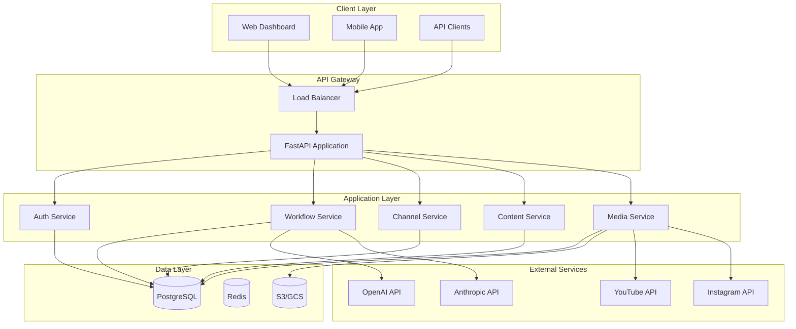
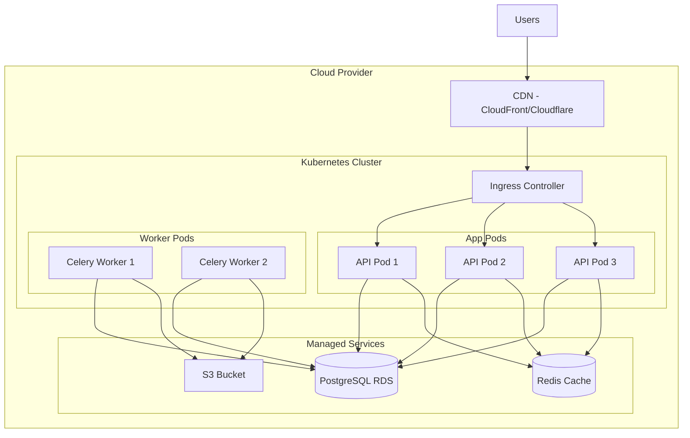
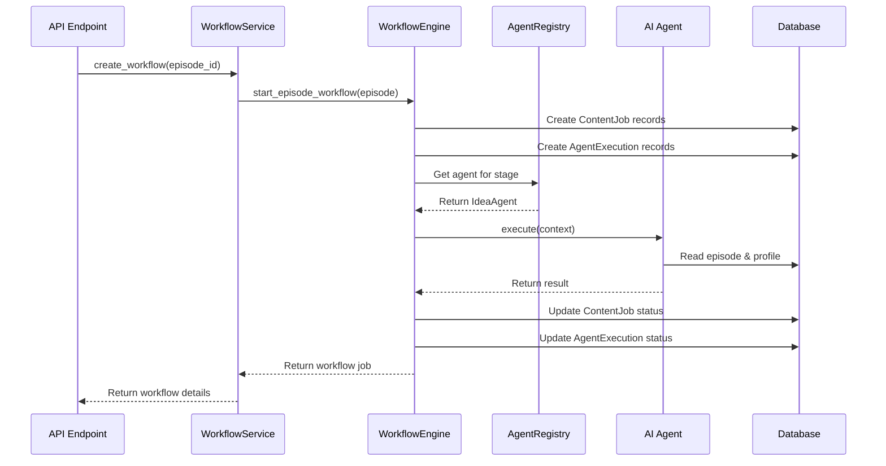
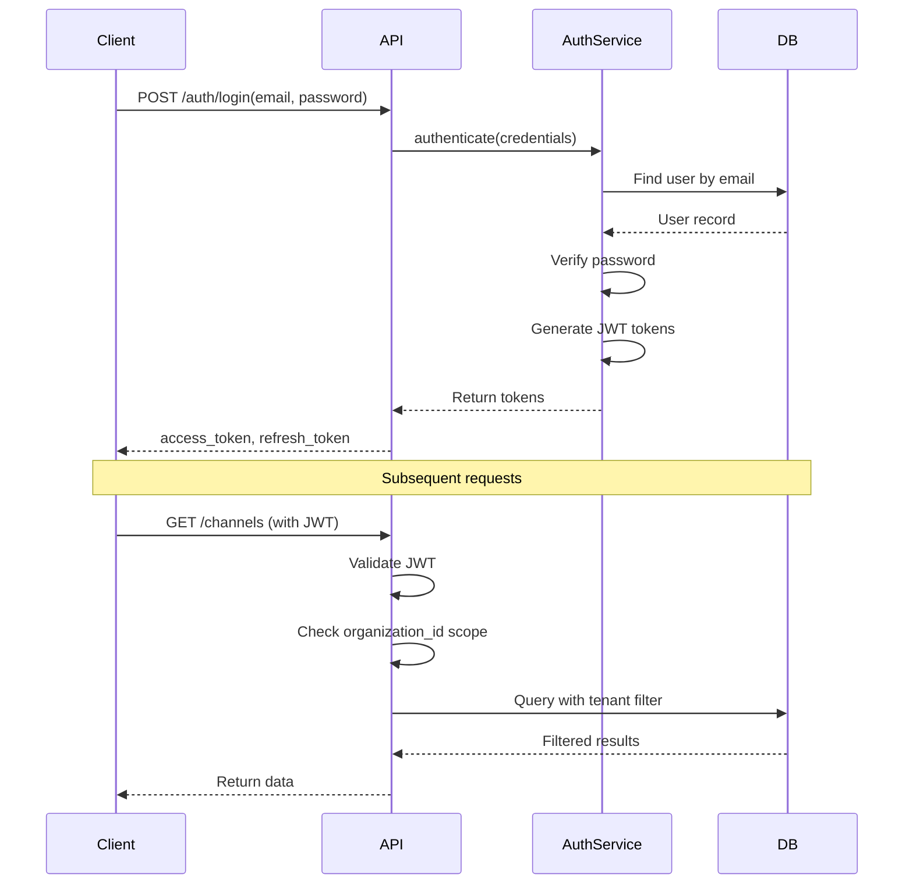

# AICF v2 System Architecture

## Executive Summary

AICF v2 is a cloud-native, multi-tenant SaaS platform for AI-powered content production. The system uses a layered architecture with clear separation of concerns, enabling scalability, maintainability, and security.

---

## High-Level Architecture



---

## Architecture Principles

### 1. Multi-Tenancy
- **Strategy**: Database-level isolation using `organization_id`
- **Implementation**: Every query scoped by tenant ID
- **Benefit**: Complete data isolation, easy scaling

### 2. Layered Architecture
- **Presentation**: RESTful API (FastAPI)
- **Business Logic**: Service layer
- **Data Access**: Repository pattern via SQLAlchemy
- **Benefit**: Clear separation, testability

### 3. Event-Driven (Future)
- **Current**: Synchronous execution
- **Future**: Async processing with Celery/RabbitMQ
- **Benefit**: Scalability, resilience

### 4. Domain-Driven Design
- **Bounded Contexts**: Identity, Content, Production, Publishing
- **Aggregates**: Organization, ChannelProfile, Episode
- **Benefit**: Clear domain boundaries

---

## Technology Stack

| Layer | Technology | Purpose |
|-------|-----------|---------|
| **Framework** | FastAPI | REST API, async support |
| **ORM** | SQLAlchemy v2 | Database abstraction |
| **Database** | PostgreSQL | Primary data store |
| **Migration** | Alembic | Schema migrations |
| **Cache** | Redis (planned) | Caching, sessions |
| **Queue** | Celery + RabbitMQ (planned) | Background jobs |
| **Auth** | JWT + bcrypt | Authentication |
| **Storage** | S3/GCS (planned) | Media storage |
| **AI** | OpenAI/Anthropic (planned) | Content generation |

---

## Directory Structure

```
/workspace
├── alembic/                 # Database migrations
│   ├── versions/           # Migration scripts
│   └── env.py              # Alembic configuration
├── agents/                  # AI Agent system
│   ├── base.py             # BaseAgent interface
│   ├── provider.py         # AI provider abstraction
│   └── registry.py         # Agent registry
├── app/                     # FastAPI application
│   ├── api/                # API routes and schemas
│   ├── auth/               # Authentication module
│   ├── middleware/         # Custom middleware
│   └── main.py             # Application entry point
├── core/                    # Core modules
│   ├── config.py           # Configuration management
│   ├── logging_config.py   # Logging setup
│   └── workflow/           # Workflow engine V2
├── database/                # Database layer
│   ├── connection.py       # DB connection factory
│   └── models.py           # SQLAlchemy models
├── docs/                    # Documentation
│   ├── product/            # Product documentation
│   ├── architecture/       # Architecture docs
│   ├── domain/             # Domain model docs
│   ├── ai/                 # AI system docs
│   └── development/        # Developer guides
├── services/                # Business logic layer
│   ├── workflow_service.py # Workflow orchestration
│   ├── channel_service.py  # Channel management
│   └── ...
├── storage/                 # Storage abstraction (planned)
├── tests/                   # Test suites
│   ├── integration/        # Integration tests
│   └── unit/              # Unit tests
└── requirements.txt         # Python dependencies
```

---

## Deployment Architecture (Current)

```
┌─────────────────────────────────────┐
│         Single Server               │
│  ┌─────────────────────────────┐    │
│  │      FastAPI (uvicorn)      │    │
│  │         Port: 8000          │    │
│  └─────────────┬───────────────┘    │
│                │                     │
│  ┌─────────────▼───────────────┐    │
│  │      SQLite Database        │    │
│  │      (Development)          │    │
│  └─────────────────────────────┘    │
│                                     │
│  ┌─────────────────────────────┐    │
│  │      Local File Storage     │    │
│  └─────────────────────────────┘    │
└─────────────────────────────────────┘
```

---

## Deployment Architecture (Production - Planned)



---

## Component Interactions

### Workflow Execution Flow



### Authentication Flow



---

## Data Flow Architecture

### Content Production Pipeline

```
User Input → Episode Creation → Workflow Initiation
                                      ↓
                              ┌───────────────┐
                              │ Stage 1: IDEA │
                              │  IdeaAgent    │
                              └───────┬───────┘
                                      ↓
                              ┌───────────────┐
                              │ Stage 2: RESEARCH │
                              │  ResearchAgent    │
                              └───────┬───────┘
                                      ↓
                              ┌───────────────┐
                              │ Stage 3: SCRIPT │
                              │  ScriptAgent    │
                              └───────┬───────┘
                                      ↓
                              ┌───────────────┐
                              │ Stage 4: STORYBOARD │
                              │  StoryboardAgent    │
                              └───────┬───────┘
                                      ↓
                              ┌───────────────┐
                              │ Stage 5: ASSET_GENERATION │
                              │  AssetAgent    │
                              └───────┬───────┘
                                      ↓
                              ┌───────────────┐
                              │ Stage 6: VIDEO_PRODUCTION │
                              │  VideoAgent    │
                              └───────┬───────┘
                                      ↓
                              ┌───────────────┐
                              │ Stage 7: SEO │
                              │  SEOAgent    │
                              └───────┬───────┘
                                      ↓
                              ┌───────────────┐
                              │ Stage 8: PUBLISH │
                              │  PublishAgent    │
                              └───────┬───────┘
                                      ↓
                              Published Content
```

---

## Security Architecture

### Defense in Depth

```
┌─────────────────────────────────────────┐
│           Network Layer                 │
│  - Firewall rules                       │
│  - DDoS protection                      │
│  - Rate limiting                        │
└─────────────────────────────────────────┘
              ↓
┌─────────────────────────────────────────┐
│         Application Layer               │
│  - JWT authentication                   │
│  - RBAC authorization                   │
│  - Input validation                     │
│  - SQL injection prevention             │
└─────────────────────────────────────────┘
              ↓
┌─────────────────────────────────────────┐
│           Data Layer                    │
│  - Tenant isolation                     │
│  - Encryption at rest                   │
│  - Audit logging                        │
│  - Backup & recovery                    │
└─────────────────────────────────────────┘
```

---

## Scalability Considerations

### Current Limitations
1. **Synchronous Processing**: Blocks request thread
2. **No Caching**: All queries hit database
3. **Single Database**: No read replicas
4. **Local Storage**: Not distributed

### Future Improvements
1. **Async Task Queue**: Celery for background jobs
2. **Redis Cache**: Query result caching
3. **Database Sharding**: By organization_id
4. **CDN**: Static asset delivery
5. **Horizontal Scaling**: Multiple API instances

---

## Monitoring & Observability

### Current
- Basic logging via Python logging
- Error messages in response
- Agent execution tracking

### Planned
- Structured logging (JSON)
- Distributed tracing (Jaeger/Zipkin)
- Metrics collection (Prometheus)
- Dashboards (Grafana)
- Alerting (PagerDuty)

---

## Document Information

- **Version**: 2.0
- **Last Updated**: 2024
- **Author**: AICF Engineering Team
- **Status**: Active Development
