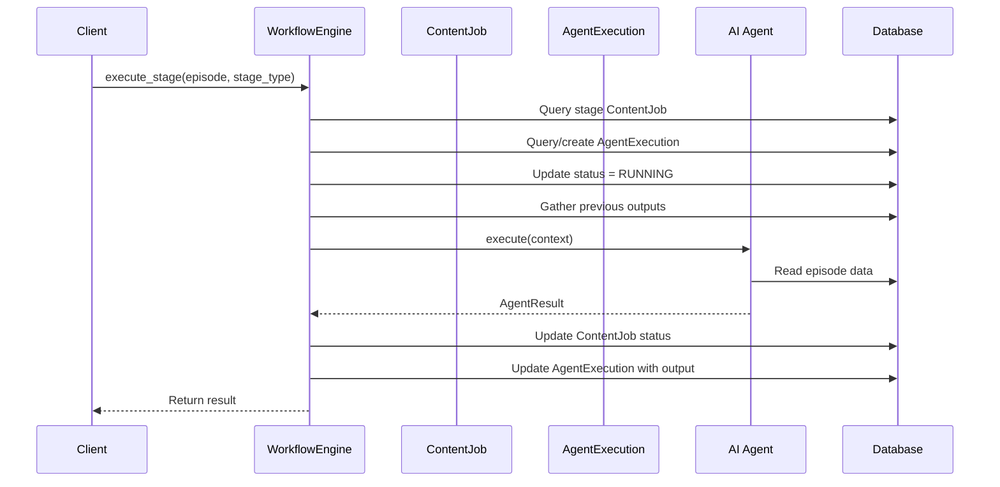

# AICF v2 Workflow Engine Documentation

## Overview

The Workflow Engine V2 is the core orchestration system for AI content production. It manages the 8-stage production pipeline from idea to published content.

---

## Architecture

### Design Principles

1. **Stateless Execution**: Engine holds no state between calls
2. **Idempotent Operations**: Safe to retry any operation
3. **Tenant-Aware**: All operations scoped by organization_id
4. **Audit Trail**: Every action logged in database records

### Components

```
┌─────────────────────────────────────────────────────────┐
│                  WorkflowEngineV2                        │
├─────────────────────────────────────────────────────────┤
│  - start_episode_workflow()                             │
│  - execute_stage()                                      │
│  - retry_stage()                                        │
│  - pause_workflow()                                     │
│  - resume_workflow()                                    │
│  - get_status()                                         │
├─────────────────────────────────────────────────────────┤
│  Registered Agents:                                     │
│  IdeaAgent → ResearchAgent → ScriptAgent → ...          │
└─────────────────────────────────────────────────────────┘
         │                    │                    │
         ▼                    ▼                    ▼
┌──────────────┐    ┌──────────────┐    ┌──────────────┐
│ ContentJob   │    │ AgentExec    │    │ WorkflowCtx  │
│ Records      │    │ Records      │    │              │
└──────────────┘    └──────────────┘    └──────────────┘
```

---

## Workflow Definition

### Stage Order

```python
STAGE_ORDER = [
    WorkflowStageType.IDEA,           # 0
    WorkflowStageType.RESEARCH,       # 1
    WorkflowStageType.SCRIPT,         # 2
    WorkflowStageType.STORYBOARD,     # 3
    WorkflowStageType.ASSET_GENERATION,  # 4
    WorkflowStageType.VIDEO_PRODUCTION,  # 5
    WorkflowStageType.SEO,            # 6
    WorkflowStageType.PUBLISH         # 7
]
```

### Workflow Instance Structure

When a workflow is started, the following records are created:

| Record Type | Count | Purpose |
|-------------|-------|---------|
| ContentJob (workflow) | 1 | Parent job tracking overall workflow |
| ContentJob (stage) | 8 | One per stage for status tracking |
| AgentExecution | 8 | One per stage for execution details |

**Total: 17 database records per workflow**

---

## Stage Execution

### Execution Flow



### Input/Output Contracts

Each stage receives context and produces structured output:

**Input Context:**
```python
{
    "episode": Episode,
    "channel_profile": ChannelProfile,
    "organization_id": int,
    "previous_outputs": {
        "idea": {...},
        "research": {...},
        ...
    },
    "settings": {
        "custom_instructions": str
    }
}
```

**Output Structure:**
```python
{
    "success": bool,
    "output": Dict[str, Any],
    "error_message": Optional[str],
    "tokens_used": int,
    "execution_time_seconds": float
}
```

---

## Retry Mechanism

### Retry Configuration

```python
class ContentJob(Base):
    retry_count = Column(Integer, default=0)
    max_retries = Column(Integer, default=3)
```

### Retry Logic

```python
def retry_stage(self, episode, stage_type, max_retries=3):
    stage_job = self._get_stage_job(episode, stage_type)
    
    # Check current retry count
    current_retries = stage_job.metadata.get("retry_count", 0)
    if current_retries >= max_retries:
        raise MaxRetriesExceededError(stage_type, max_retries)
    
    # Reset status for retry
    stage_job.status = ContentJobStatus.RETRYING
    stage_job.metadata["retry_count"] = current_retries + 1
    
    # Execute stage again
    return self.execute_stage(episode, stage_type)
```

### Retry States

```
FAILED → RETRYING → RUNNING → COMPLETED
                     ↓
                   FAILED → (repeat up to max_retries)
```

---

## Pause/Resume

### Pause Operation

```python
def pause_workflow(self, episode):
    # Find all running jobs
    running_jobs = db.query(ContentJob).filter(
        episode_id=episode.id,
        status=ContentJobStatus.RUNNING
    ).all()
    
    # Set to PENDING (paused state)
    for job in running_jobs:
        job.status = ContentJobStatus.PENDING
    
    # Same for agent executions
    running_executions = db.query(AgentExecution).filter(
        episode_id=episode.id,
        status=AgentExecutionStatus.RUNNING
    ).all()
    
    for exec in running_executions:
        exec.status = AgentExecutionStatus.PENDING
```

### Resume Operation

```python
def resume_workflow(self, episode):
    # Find first incomplete stage
    pending_jobs = db.query(ContentJob).filter(
        episode_id=episode.id,
        status=ContentJobStatus.PENDING
    ).order_by(ContentJob.stage_order).all()
    
    if not pending_jobs:
        raise WorkflowNotPausedError()
    
    # Resume from first pending stage
    first_pending = pending_jobs[0]
    stage_type = WorkflowStageType(first_pending.stage_type)
    return self.execute_stage(episode, stage_type)
```

---

## Error Handling

### Exception Types

| Exception | When Raised | Recovery |
|-----------|-------------|----------|
| WorkflowError | Base exception | Catch and log |
| StageExecutionError | Stage fails | Retry or escalate |
| StageNotFoundError | Invalid stage | Fix stage reference |
| WorkflowNotPausedError | Resume non-paused | Check status first |
| InvalidStageTransitionError | Wrong stage order | Fix workflow logic |
| AgentExecutionError | Agent fails | Retry with backoff |
| WorkflowValidationError | Invalid input | Fix input data |

### Error Propagation

```python
try:
    result = agent.execute(context)
except Exception as e:
    logger.error(f"Stage failed: {e}")
    self._mark_stage_failed(stage_job, agent_execution, str(e))
    return {
        "success": False,
        "error_message": str(e),
        "stage_type": stage_type.value
    }
```

---

## Status Tracking

### Get Status Response

```json
{
  "episode_id": 123,
  "episode_title": "Ancient Mysteries Documentary",
  "overall_status": "running",
  "total_stages": 8,
  "completed_stages": 3,
  "stages": [
    {
      "stage_type": "idea",
      "stage_order": 0,
      "job_id": 456,
      "status": "completed",
      "started_at": "2024-01-15T10:00:00Z",
      "completed_at": "2024-01-15T10:00:05Z",
      "retry_count": 0,
      "executions": [
        {
          "id": 789,
          "agent_name": "idea_agent",
          "status": "success",
          "execution_time": 2.5,
          "tokens_used": 150
        }
      ]
    }
  ]
}
```

### Status Aggregation

```python
def get_status(self, episode):
    content_jobs = self._get_all_jobs(episode)
    agent_executions = self._get_all_executions(episode)
    
    # Determine overall status
    if any(s["status"] == "failed" for s in stages):
        overall = "failed"
    elif all(s["status"] == "completed" for s in stages):
        overall = "completed"
    elif any(s["status"] == "running" for s in stages):
        overall = "running"
    else:
        overall = "pending"
    
    return {
        "overall_status": overall,
        "progress": f"{completed}/{total}",
        "stages": stage_details
    }
```

---

## Future Scalability

### Current Limitations

1. **Synchronous Execution**: Blocks request thread
2. **No Distributed Locking**: Cannot scale horizontally
3. **Memory-Based State**: No workflow state persistence
4. **Limited Concurrency**: One workflow per request

### Planned Improvements

#### Phase 10: Async Processing

```python
# Future Celery task
@celery.task(bind=True, max_retries=3)
def execute_stage_task(self, episode_id, stage_type, org_id):
    try:
        engine = WorkflowEngineV2(db_session)
        result = engine.execute_stage(episode_id, stage_type)
        return result
    except Exception as e:
        raise self.retry(exc=e, countdown=2**self.request.retries)
```

#### Phase 10: Workflow State Machine

```python
class WorkflowState:
    def __init__(self, workflow_id):
        self.redis = Redis()
        self.key = f"workflow:{workflow_id}"
    
    def save(self, state_dict):
        self.redis.setex(self.key, 3600, json.dumps(state_dict))
    
    def load(self):
        data = self.redis.get(self.key)
        return json.loads(data) if data else None
```

#### Phase 10: Distributed Locking

```python
from redis_lock import Lock

def execute_stage_with_lock(self, episode, stage_type):
    lock_key = f"workflow_lock:{episode.id}:{stage_type.value}"
    with Lock(redis_client, lock_key, expire=300):
        return self.execute_stage(episode, stage_type)
```

---

## Document Information

- **Version**: 2.0
- **Last Updated**: 2024
- **Author**: AICF Engineering Team
- **Status**: Active Development
