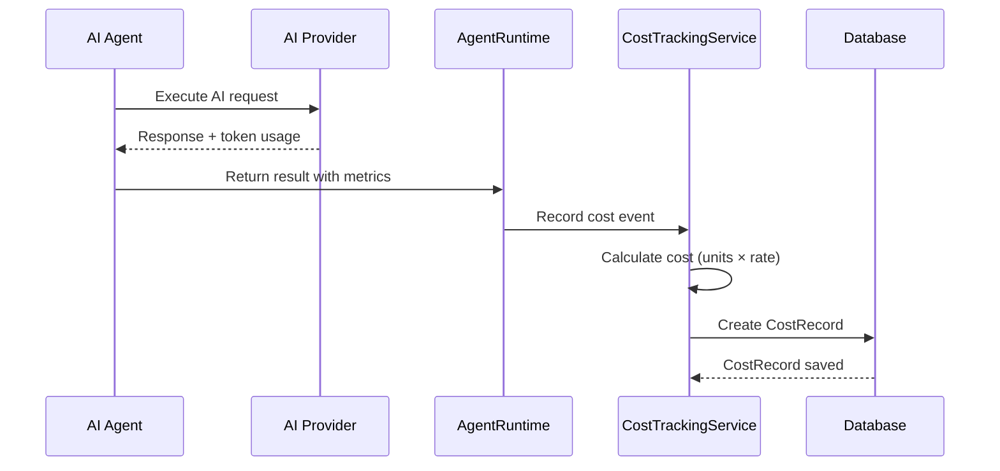

# AICF v2 Cost Tracking Documentation

## Overview

The Cost Tracking system provides comprehensive monitoring and recording of all AI-related costs across the AICF v2 platform. It enables accurate billing, cost attribution per episode/organization, and financial analytics.

---

## Purpose

The cost tracking system serves several critical business functions:

1. **Cost Attribution**: Track costs per episode, organization, and agent
2. **Billing Accuracy**: Provide detailed records for customer billing
3. **Financial Analytics**: Enable cost optimization and budgeting
4. **Provider Management**: Compare costs across different AI providers
5. **Usage Monitoring**: Detect anomalies and prevent cost overruns

---

## Database Schema

### CostRecord Model

```python
class CostRecord(Base):
    __tablename__ = "cost_records"
```

#### Fields

| Field | Type | Nullable | Description |
|-------|------|----------|-------------|
| `id` | Integer | No | Primary key |
| `organization_id` | Integer | No | Foreign key to organizations (tenant isolation) |
| `episode_id` | Integer | Yes | Foreign key to episodes (cost attribution) |
| `content_job_id` | Integer | Yes | Foreign key to content_jobs |
| `agent_execution_id` | Integer | Yes | Foreign key to agent_executions |
| `asset_id` | Integer | Yes | Foreign key to assets |
| `cost_type` | String(50) | No | Type: image_generation, voice_generation, storage, rendering, api_call |
| `provider` | String(100) | No | AI provider name (openai, anthropic, elevenlabs, etc.) |
| `model` | String(200) | Yes | Specific model used (gpt-4, claude-3, etc.) |
| `units` | Float | No | Usage units (tokens, seconds, GB, etc.) |
| `unit_type` | String(50) | No | Type of unit (tokens, seconds, gigabytes, requests) |
| `unit_cost` | Decimal(10,6) | No | Cost per unit in USD |
| `estimated_cost` | Decimal(10,6) | No | Total estimated cost (units × unit_cost) |
| `actual_cost` | Decimal(10,6) | Yes | Actual charged cost (may differ from estimate) |
| `currency` | String(3) | No | Currency code (default: USD) |
| `metadata` | JSON | Yes | Additional cost details |
| `billed` | Boolean | No | Whether cost has been billed (default: false) |
| `billed_at` | DateTime | Yes | Timestamp when cost was billed |
| `created_at` | DateTime | No | Record creation timestamp |
| `updated_at` | DateTime | Yes | Last update timestamp |

#### Indexes

```sql
CREATE INDEX idx_cost_org ON cost_records(organization_id);
CREATE INDEX idx_cost_episode ON cost_records(episode_id);
CREATE INDEX idx_cost_type ON cost_records(cost_type);
CREATE INDEX idx_cost_provider ON cost_records(provider);
CREATE INDEX idx_cost_billed ON cost_records(billed);
CREATE INDEX idx_cost_created ON cost_records(created_at);
CREATE INDEX idx_cost_org_created ON cost_records(organization_id, created_at);
```

---

## Cost Types

### Image Generation Costs

Tracked when generating images via AI providers:

- **Providers**: OpenAI DALL-E, Stability AI, Midjourney API
- **Units**: Number of images generated
- **Unit Type**: `requests`
- **Metadata**: Resolution, model, prompt complexity

### Voice Generation Costs

Tracked when generating voice/speech:

- **Providers**: ElevenLabs, Google TTS, Amazon Polly
- **Units**: Characters or seconds of audio
- **Unit Type**: `characters` or `seconds`
- **Metadata**: Voice ID, language, quality tier

### Storage Costs

Tracked for asset storage:

- **Providers**: AWS S3, Google Cloud Storage, Azure Blob
- **Units**: Gigabytes stored
- **Unit Type**: `gigabytes`
- **Metadata**: Storage class, region, retention period

### Rendering Costs

Tracked for video rendering (future):

- **Providers**: AWS Elemental, RenderMan, custom renderers
- **Units**: Rendering minutes or compute hours
- **Unit Type**: `minutes` or `compute_hours`
- **Metadata**: Resolution, frame rate, complexity

### API Call Costs

General API usage costs:

- **Providers**: Any LLM or AI service
- **Units**: Tokens (input + output)
- **Unit Type**: `tokens`
- **Metadata**: Token breakdown, model version

---

## Relationships

### Entity Relationship Diagram

```
┌─────────────────┐       ┌─────────────────┐
│  Organization   │       │     Episode     │
└────────┬────────┘       └────────┬────────┘
         │                         │
         │ 1:N                     │ 1:N
         ▼                         ▼
┌─────────────────────────────────────────────────┐
│                  CostRecord                      │
│  - organization_id (FK)                          │
│  - episode_id (FK)                               │
│  - content_job_id (FK)                           │
│  - agent_execution_id (FK)                       │
│  - asset_id (FK)                                 │
└─────────────────────────────────────────────────┘
         ▲                         ▲
         │                         │
         │ N:1                     │ N:1
         │                         │
┌─────────────────┐       ┌─────────────────┐
│  ContentJob     │       │ AgentExecution  │
└─────────────────┘       └─────────────────┘
```

### Foreign Key Constraints

```sql
ALTER TABLE cost_records 
    ADD CONSTRAINT fk_cost_organization 
    FOREIGN KEY (organization_id) REFERENCES organizations(id) ON DELETE CASCADE;

ALTER TABLE cost_records 
    ADD CONSTRAINT fk_cost_episode 
    FOREIGN KEY (episode_id) REFERENCES episodes(id) ON DELETE SET NULL;

ALTER TABLE cost_records 
    ADD CONSTRAINT fk_cost_job 
    FOREIGN KEY (content_job_id) REFERENCES content_jobs(id) ON DELETE SET NULL;

ALTER TABLE cost_records 
    ADD CONSTRAINT fk_cost_execution 
    FOREIGN KEY (agent_execution_id) REFERENCES agent_executions(id) ON DELETE SET NULL;

ALTER TABLE cost_records 
    ADD CONSTRAINT fk_cost_asset 
    FOREIGN KEY (asset_id) REFERENCES assets(id) ON DELETE SET NULL;
```

---

## Cost Tracking Flow

### Execution Flow



### Cost Calculation

```python
def calculate_cost(
    provider: str,
    model: str,
    units: float,
    unit_type: str,
    cost_type: str
) -> Decimal:
    """
    Calculate cost based on provider pricing.
    
    Args:
        provider: AI provider name
        model: Specific model used
        units: Usage amount
        unit_type: Type of units (tokens, seconds, etc.)
        cost_type: Category of cost
        
    Returns:
        Estimated cost in USD
    """
    # Get pricing from provider configuration
    pricing = get_provider_pricing(provider, model, cost_type)
    
    # Calculate cost
    unit_cost = pricing.get(unit_type, 0.0)
    estimated_cost = units * unit_cost
    
    return Decimal(str(estimated_cost)).quantize(Decimal('0.000001'))
```

### Example Pricing Configuration

```python
PROVIDER_PRICING = {
    "openai": {
        "gpt-4": {
            "tokens": {
                "input": 0.00003,      # $0.03 per 1K tokens
                "output": 0.00006      # $0.06 per 1K tokens
            }
        },
        "dall-e-3": {
            "requests": {
                "standard": 0.040,     # $0.040 per image
                "hd": 0.080            # $0.080 per HD image
            }
        }
    },
    "anthropic": {
        "claude-3-opus": {
            "tokens": {
                "input": 0.000015,     # $0.015 per 1K tokens
                "output": 0.000075     # $0.075 per 1K tokens
            }
        }
    },
    "elevenlabs": {
        "voice_generation": {
            "characters": 0.000006     # $0.006 per 1K characters
        }
    }
}
```

---

## Organization Billing Isolation

### Tenant Isolation Guarantee

All cost records are strictly scoped to their organization:

1. **Database Level**: `organization_id` is NOT NULL and indexed
2. **Query Level**: All queries filter by `organization_id`
3. **Service Level**: Cost service validates organization context
4. **API Level**: Authentication ensures organization access

### Billing Query Examples

```python
# Get total costs for an organization
def get_organization_costs(org_id: int, start_date: datetime, end_date: datetime) -> Decimal:
    total = db.query(func.sum(CostRecord.estimated_cost)).filter(
        CostRecord.organization_id == org_id,
        CostRecord.created_at >= start_date,
        CostRecord.created_at <= end_date
    ).scalar()
    return total or Decimal('0.00')

# Get costs by type
def get_costs_by_type(org_id: int, cost_type: str) -> List[CostRecord]:
    return db.query(CostRecord).filter(
        CostRecord.organization_id == org_id,
        CostRecord.cost_type == cost_type
    ).all()

# Get unbilled costs
def get_unbilled_costs(org_id: int) -> List[CostRecord]:
    return db.query(CostRecord).filter(
        CostRecord.organization_id == org_id,
        CostRecord.billed == False
    ).all()
```

### Cost Aggregation

```python
def generate_billing_report(
    org_id: int,
    billing_period_start: datetime,
    billing_period_end: datetime
) -> Dict:
    """Generate comprehensive billing report for organization."""
    
    costs = db.query(CostRecord).filter(
        CostRecord.organization_id == org_id,
        CostRecord.created_at >= billing_period_start,
        CostRecord.created_at <= billing_period_end
    ).all()
    
    # Aggregate by type
    by_type = defaultdict(Decimal)
    by_provider = defaultdict(Decimal)
    by_episode = defaultdict(Decimal)
    
    for cost in costs:
        by_type[cost.cost_type] += cost.estimated_cost
        by_provider[cost.provider] += cost.estimated_cost
        if cost.episode_id:
            by_episode[cost.episode_id] += cost.estimated_cost
    
    return {
        "organization_id": org_id,
        "period_start": billing_period_start,
        "period_end": billing_period_end,
        "total_cost": sum(by_type.values()),
        "breakdown_by_type": dict(by_type),
        "breakdown_by_provider": dict(by_provider),
        "breakdown_by_episode": dict(by_episode),
        "record_count": len(costs)
    }
```

---

## Service Layer

### CostTrackingService

```python
class CostTrackingService:
    """Service for managing cost records and billing."""
    
    def __init__(self, db_session: Session):
        self.db = db_session
    
    def record_cost(
        self,
        organization_id: int,
        cost_type: str,
        provider: str,
        model: str,
        units: float,
        unit_type: str,
        episode_id: Optional[int] = None,
        content_job_id: Optional[int] = None,
        agent_execution_id: Optional[int] = None,
        asset_id: Optional[int] = None,
        metadata: Optional[Dict] = None
    ) -> CostRecord:
        """Record a new cost entry."""
        pass
    
    def calculate_cost(self, provider: str, model: str, units: float, unit_type: str) -> Decimal:
        """Calculate cost based on provider pricing."""
        pass
    
    def get_organization_costs(self, org_id: int, start_date: datetime, end_date: datetime) -> Decimal:
        """Get total costs for organization in date range."""
        pass
    
    def generate_billing_report(self, org_id: int, period_start: datetime, period_end: datetime) -> Dict:
        """Generate billing report for organization."""
        pass
    
    def mark_as_billed(self, cost_record_ids: List[int], billed_at: datetime = None):
        """Mark cost records as billed."""
        pass
```

---

## Integration Points

### With Agent Execution

```python
# In AgentRuntime.execute_and_store()
result = agent.execute(context)

# Record cost
if result.token_usage:
    cost_service.record_cost(
        organization_id=context.organization_id,
        episode_id=context.episode.id,
        agent_execution_id=execution_record.id,
        cost_type="api_call",
        provider=agent.provider_name,
        model=agent.model,
        units=result.token_usage,
        unit_type="tokens",
        metadata={"input_tokens": result.input_tokens, "output_tokens": result.output_tokens}
    )
```

### With Asset Generation

```python
# When asset is generated
asset = Asset(...)
db.add(asset)
db.commit()

# Record generation cost
cost_service.record_cost(
    organization_id=asset.organization_id,
    asset_id=asset.id,
    episode_id=asset.episode_id,
    cost_type="image_generation",
    provider="openai",
    model="dall-e-3",
    units=1,
    unit_type="requests",
    metadata={"resolution": "1024x1024"}
)
```

### With Workflow Engine

```python
# In WorkflowEngine after stage completion
def execute_stage(self, episode, stage_type):
    # ... execute stage ...
    
    # Record workflow execution cost
    total_tokens = sum(execution.total_tokens for execution in executions)
    cost_service.record_cost(
        organization_id=episode.organization_id,
        episode_id=episode.id,
        content_job_id=workflow_job.id,
        cost_type="api_call",
        provider="multi-provider",
        model="various",
        units=total_tokens,
        unit_type="tokens"
    )
```

---

## Monitoring & Alerts

### Cost Thresholds

```python
COST_THRESHOLDS = {
    "daily_limit": 100.00,      # Alert if daily costs exceed $100
    "episode_limit": 5.00,      # Alert if single episode exceeds $5
    "monthly_budget": 2000.00,  # Monthly budget alert
    "anomaly_detection": True   # Detect unusual spending patterns
}
```

### Alert Conditions

1. **Daily Limit Exceeded**: Notify admin when daily costs exceed threshold
2. **Episode Cost Spike**: Alert when episode cost > 3× average
3. **Budget Warning**: Notify at 80% and 95% of monthly budget
4. **Anomaly Detection**: ML-based detection of unusual patterns

---

## Future Enhancements

### Planned Features

1. **Real-time Cost Dashboard**: Live cost monitoring per organization
2. **Budget Management**: Set and enforce budgets per organization/project
3. **Cost Optimization Recommendations**: AI-driven suggestions to reduce costs
4. **Multi-currency Support**: Handle multiple currencies for international billing
5. **Invoice Generation**: Automated invoice creation and delivery
6. **Cost Forecasting**: Predict future costs based on usage patterns

### Phase 8+ Roadmap

- **Phase 8**: Integrate with video rendering cost tracking
- **Phase 9**: Implement budget enforcement and hard limits
- **Phase 10**: Advanced analytics and ML-based forecasting

---

## Document Information

- **Version**: 1.0
- **Last Updated**: Phase 7.99
- **Author**: AICF Engineering Team
- **Status**: Production Ready
- **Related Documents**: 
  - `database-schema.md`
  - `aicf-current-architecture.md`
  - `media-cost-management.md`
