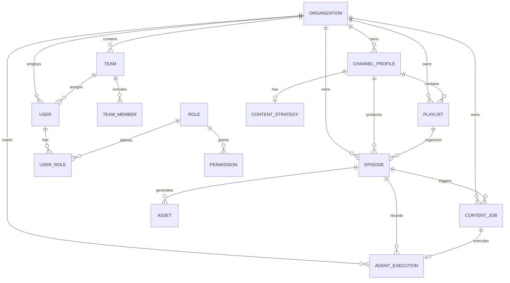

# AICF v2 Entity Relationships

## Overview

This document details all entity relationships in the AICF v2 database schema.

---

## Entity Relationship Diagram



---

## Relationship Details

### Organization Relationships

| Relationship | Target | Cardinality | Description |
|-------------|--------|-------------|-------------|
| organizations.teams | Team | 1:N | Teams within organization |
| organizations.users | User | 1:N | Users belonging to org |
| organizations.channel_profiles | ChannelProfile | 1:N | Channels owned by org |
| organizations.playlists | Playlist | 1:N | Playlists created by org |
| organizations.episodes | Episode | 1:N | Episodes produced by org |

### User & Role Relationships

| Relationship | Target | Cardinality | Description |
|-------------|--------|-------------|-------------|
| users.user_roles | UserRole | 1:N | Roles assigned to user |
| roles.user_roles | UserRole | 1:N | Users with this role |
| roles.permissions | Permission | N:M | Permissions granted to role |

### Channel Profile Relationships

| Relationship | Target | Cardinality | Description |
|-------------|--------|-------------|-------------|
| channel_profiles.content_strategy | ContentStrategy | 1:1 | Strategy for channel |
| channel_profiles.playlists | Playlist | 1:N | Playlists for channel |
| channel_profiles.episodes | Episode | 1:N | Episodes for channel |

### Playlist Relationships

| Relationship | Target | Cardinality | Description |
|-------------|--------|-------------|-------------|
| playlists.channel_profile | ChannelProfile | N:1 | Parent channel |
| playlists.episodes | Episode | 1:N | Episodes in playlist |

### Episode Relationships

| Relationship | Target | Cardinality | Description |
|-------------|--------|-------------|-------------|
| episodes.playlist | Playlist | N:1 | Parent playlist |
| episodes.channel_profile | ChannelProfile | N:1 | Associated channel |
| episodes.content_jobs | ContentJob | 1:N | Workflow jobs |
| episodes.agent_executions | AgentExecution | 1:N | Execution records |
| episodes.assets | Asset | 1:N | Generated assets |

### ContentJob Relationships

| Relationship | Target | Cardinality | Description |
|-------------|--------|-------------|-------------|
| content_jobs.episode | Episode | N:1 | Parent episode |
| content_jobs.agent_execution | AgentExecution | 1:1 | Associated execution |

---

## Foreign Key Constraints

```sql
-- Organization references
ALTER TABLE teams ADD CONSTRAINT fk_teams_organization 
    FOREIGN KEY (organization_id) REFERENCES organizations(id) ON DELETE CASCADE;

ALTER TABLE users ADD CONSTRAINT fk_users_organization 
    FOREIGN KEY (organization_id) REFERENCES organizations(id) ON DELETE CASCADE;

-- Channel profile references
ALTER TABLE channel_profiles ADD CONSTRAINT fk_channel_org 
    FOREIGN KEY (organization_id) REFERENCES organizations(id) ON DELETE CASCADE;

-- Playlist references
ALTER TABLE playlists ADD CONSTRAINT fk_playlist_org 
    FOREIGN KEY (organization_id) REFERENCES organizations(id) ON DELETE CASCADE;
ALTER TABLE playlists ADD CONSTRAINT fk_playlist_channel 
    FOREIGN KEY (channel_profile_id) REFERENCES channel_profiles(id);

-- Episode references
ALTER TABLE episodes ADD CONSTRAINT fk_episode_org 
    FOREIGN KEY (organization_id) REFERENCES organizations(id) ON DELETE CASCADE;
ALTER TABLE episodes ADD CONSTRAINT fk_episode_playlist 
    FOREIGN KEY (playlist_id) REFERENCES playlists(id);
ALTER TABLE episodes ADD CONSTRAINT fk_episode_channel 
    FOREIGN KEY (channel_profile_id) REFERENCES channel_profiles(id);

-- ContentJob references
ALTER TABLE content_jobs ADD CONSTRAINT fk_job_org 
    FOREIGN KEY (organization_id) REFERENCES organizations(id) ON DELETE CASCADE;
ALTER TABLE content_jobs ADD CONSTRAINT fk_job_episode 
    FOREIGN KEY (episode_id) REFERENCES episodes(id) ON DELETE CASCADE;

-- AgentExecution references
ALTER TABLE agent_executions ADD CONSTRAINT fk_exec_org 
    FOREIGN KEY (organization_id) REFERENCES organizations(id) ON DELETE CASCADE;
ALTER TABLE agent_executions ADD CONSTRAINT fk_exec_episode 
    FOREIGN KEY (episode_id) REFERENCES episodes(id) ON DELETE CASCADE;
ALTER TABLE agent_executions ADD CONSTRAINT fk_exec_job 
    FOREIGN KEY (content_job_id) REFERENCES content_jobs(id);
```

---

## Cascade Behavior

### Delete Cascades

| Parent Entity | Child Entities | Cascade Type |
|--------------|----------------|--------------|
| Organization | All entities | CASCADE |
| Team | TeamMember | CASCADE |
| ChannelProfile | ContentStrategy, Playlists, Episodes | CASCADE |
| Playlist | Episodes | CASCADE |
| Episode | ContentJobs, AgentExecutions, Assets | CASCADE |
| ContentJob | AgentExecution | CASCADE |

### Update Cascades

Foreign keys use `ON UPDATE CASCADE` for ID changes (rare).

---

## Document Information

- **Version**: 2.0
- **Last Updated**: 2024
- **Author**: AICF Engineering Team
- **Status**: Active Development
