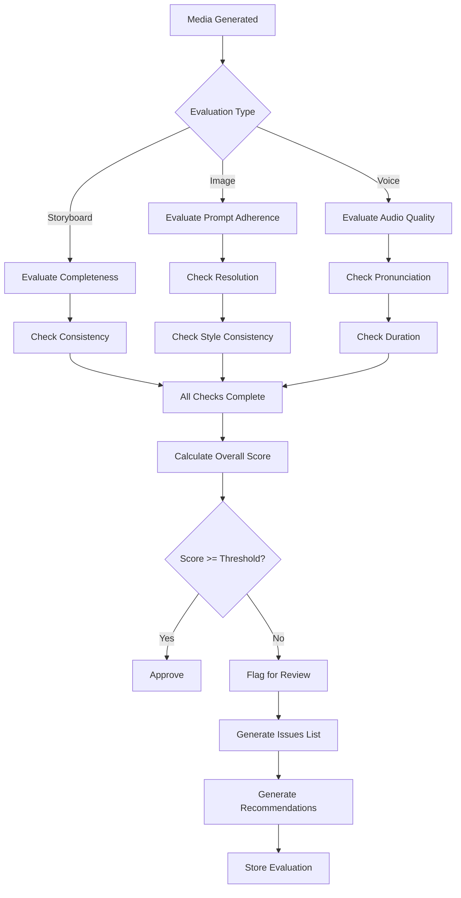

# AICF v2 Media Quality System Documentation

## Overview

The Media Quality Evaluation system provides automated and human-assisted quality assessment for all media assets generated in the AICF v2 platform. It ensures content meets quality standards before approval and use in production.

---

## Purpose

The media quality system serves several critical functions:

1. **Quality Assurance**: Automated evaluation of generated media
2. **Consistency Enforcement**: Ensure brand and style consistency
3. **Approval Support**: Provide data for human approval decisions
4. **Feedback Loop**: Enable continuous improvement of generation models
5. **Cost Control**: Catch low-quality outputs before expensive downstream processing

---

## Evaluation Types

### Image Evaluation

Evaluates AI-generated images against multiple criteria:

| Criterion | Description | Score Range |
|-----------|-------------|-------------|
| `prompt_adherence` | How well image matches the prompt | 0-100 |
| `resolution` | Image resolution quality | 0-100 |
| `style_consistency` | Consistency with brand style guidelines | 0-100 |
| `overall_quality` | Combined quality score | 0-100 |

### Voice Evaluation

Evaluates AI-generated voice/speech:

| Criterion | Description | Score Range |
|-----------|-------------|-------------|
| `duration` | Appropriate duration for content | 0-100 |
| `audio_quality` | Clarity and production quality | 0-100 |
| `pronunciation` | Accuracy of pronunciation | 0-100 |
| `overall_quality` | Combined quality score | 0-100 |

### Storyboard Evaluation

Evaluates storyboards for completeness and consistency:

| Criterion | Description | Score Range |
|-----------|-------------|-------------|
| `completeness` | All required elements present | 0-100 |
| `consistency` | Visual and narrative consistency | 0-100 |
| `overall_quality` | Combined quality score | 0-100 |

---

## Database Schema

### MediaQualityScore Model

```python
class MediaQualityScore(Base):
    __tablename__ = "media_quality_scores"
```

#### Fields

| Field | Type | Description |
|-------|------|-------------|
| `id` | Integer | Primary key |
| `asset_id` | Integer | Foreign key to assets (nullable) |
| `episode_id` | Integer | Foreign key to episodes (nullable) |
| `organization_id` | Integer | Foreign key to organizations |
| `evaluation_type` | QualityEvaluationType | image, voice, storyboard, video |
| `quality_score` | Float | Overall quality score (0-100) |
| `prompt_adherence_score` | Float | For images |
| `resolution_score` | Float | For images |
| `style_consistency_score` | Float | For images |
| `duration_score` | Float | For voice |
| `audio_quality_score` | Float | For voice |
| `pronunciation_score` | Float | For voice |
| `completeness_score` | Float | For storyboards |
| `consistency_score` | Float | For storyboards |
| `issues` | JSON | List of identified issues |
| `recommendations` | JSON | List of improvement recommendations |
| `approval_status` | ApprovalStatus | pending, approved, rejected, changes_requested |
| `evaluator_type` | String(50) | automated, human, hybrid |
| `evaluator_id` | Integer | User ID if human evaluation |
| `evaluator_name` | String(255) | Evaluator name |
| `evaluation_criteria` | JSON | Criteria used for evaluation |
| `evaluation_data` | JSON | Raw evaluation data |
| `reviewed_by` | Integer | Reviewer user ID |
| `reviewed_at` | DateTime | Review timestamp |
| `review_notes` | Text | Review notes |
| `created_at` | DateTime | Creation timestamp |
| `updated_at` | DateTime | Last update timestamp |

#### Indexes

```sql
CREATE INDEX idx_quality_asset ON media_quality_scores(asset_id);
CREATE INDEX idx_quality_episode ON media_quality_scores(episode_id);
CREATE INDEX idx_quality_org ON media_quality_scores(organization_id);
CREATE INDEX idx_quality_type ON media_quality_scores(evaluation_type);
CREATE INDEX idx_quality_approval ON media_quality_scores(approval_status);
```

---

## Quality Evaluator

### MediaQualityEvaluator Class

```python
class MediaQualityEvaluator:
    """
    Evaluates media quality across different types.
    
    Supports:
    - Image evaluation (prompt adherence, resolution, style)
    - Voice evaluation (duration, quality, pronunciation)
    - Storyboard evaluation (completeness, consistency)
    """
    
    def evaluate_image(
        self,
        asset: Asset,
        prompt: str,
        style_guidelines: Dict
    ) -> MediaQualityScore:
        """Evaluate generated image quality."""
        pass
    
    def evaluate_voice(
        self,
        asset: Asset,
        script: str,
        voice_settings: Dict
    ) -> MediaQualityScore:
        """Evaluate generated voice quality."""
        pass
    
    def evaluate_storyboard(
        self,
        storyboard: Dict,
        requirements: Dict
    ) -> MediaQualityScore:
        """Evaluate storyboard completeness and consistency."""
        pass
```

### Evaluation Process



---

## Approval Status Flow

### Status Definitions

| Status | Description | Next Actions |
|--------|-------------|--------------|
| `pending` | Awaiting evaluation or review | Evaluate, Auto-approve |
| `approved` | Meets quality standards | Use in production |
| `rejected` | Does not meet standards | Regenerate, Escalate |
| `changes_requested` | Needs modifications | Modify, Re-evaluate |

### Status Transitions

```
┌───────────┐
│  PENDING  │
└─────┬─────┘
      │ evaluate
      ▼
┌───────────┐     ┌───────────────┐
│ APPROVED  │◄────│ CHANGES_      │
└───────────┘     │ REQUESTED     │
      ▲           └───────┬───────┘
      │                   │ modify & re-evaluate
      │                   ▼
┌───────────┐     ┌───────────────┐
│ REJECTED  │◄────│  (re-eval)    │
└───────────┘
```

---

## Service Layer

### QualityEvaluationService

```python
class QualityEvaluationService:
    """Service for managing quality evaluations."""
    
    def __init__(self, db_session: Session):
        self.db = db_session
        self.evaluator = MediaQualityEvaluator()
    
    def evaluate_asset(
        self,
        asset_id: int,
        evaluator_type: str = "automated",
        evaluator_id: Optional[int] = None
    ) -> MediaQualityScore:
        """Run quality evaluation on an asset."""
        pass
    
    def get_evaluation(self, asset_id: int) -> Optional[MediaQualityScore]:
        """Get evaluation for an asset."""
        pass
    
    def approve_evaluation(
        self,
        evaluation_id: int,
        reviewed_by: int,
        notes: Optional[str] = None
    ) -> MediaQualityScore:
        """Manually approve an evaluation."""
        pass
    
    def reject_evaluation(
        self,
        evaluation_id: int,
        reviewed_by: int,
        reason: str
    ) -> MediaQualityScore:
        """Reject an evaluation."""
        pass
    
    def request_changes(
        self,
        evaluation_id: int,
        reviewed_by: int,
        change_requests: List[str]
    ) -> MediaQualityScore:
        """Request changes for an evaluation."""
        pass
```

---

## Integration Points

### With Asset Lifecycle

```python
# After successful evaluation
if quality_score.quality_score >= THRESHOLD and quality_score.approval_status == ApprovalStatus.APPROVED:
    lifecycle_service.transition_state(
        asset_id=asset.id,
        to_state=AssetState.READY,
        triggered_by="system",
        reason="Quality evaluation passed",
        context={"quality_score": quality_score.quality_score}
    )
```

### With Approval Workflow

```python
# Create approval request for borderline cases
if 60 <= quality_score.quality_score < 80:
    approval_request = ApprovalRequest(
        asset_id=asset.id,
        request_type="asset",
        request_title=f"Quality review for {asset.asset_type}",
        status=ApprovalStatus.PENDING,
        metadata={"quality_score": quality_score.quality_score}
    )
```

### With Knowledge System

```python
# Store successful patterns
if quality_score.quality_score >= 90:
    knowledge_service.store_pattern(
        organization_id=asset.organization_id,
        pattern_type="successful_visual_style",
        data={
            "asset_type": asset.asset_type,
            "prompt": asset.prompt,
            "style_parameters": asset.style_params,
            "quality_score": quality_score.quality_score
        }
    )
```

---

## Tenant Isolation

All quality evaluations are scoped by organization:

```python
# Query includes organization filter
evaluations = db.query(MediaQualityScore).filter(
    MediaQualityScore.asset_id == asset_id,
    MediaQualityScore.organization_id == organization_id
).all()

# Service validates organization context
def evaluate_asset(self, asset_id, ...):
    asset = self.db.query(Asset).filter(
        Asset.id == asset_id,
        Asset.organization_id == context.organization_id
    ).first()
    
    if not asset:
        raise AssetNotFoundError("Asset not found in your organization")
```

---

## Usage Examples

### Automated Image Evaluation

```python
# Evaluate generated image
evaluation = quality_service.evaluate_asset(
    asset_id=image_asset.id,
    evaluator_type="automated"
)

# Check result
if evaluation.quality_score >= 80:
    print(f"Image approved with score {evaluation.quality_score}")
else:
    print(f"Issues found: {evaluation.issues}")
    print(f"Recommendations: {evaluation.recommendations}")
```

### Human Review

```python
# Get evaluation pending review
pending = db.query(MediaQualityScore).filter(
    MediaQualityScore.approval_status == ApprovalStatus.PENDING,
    MediaQualityScore.evaluator_type == "automated"
).all()

# Review and approve
for eval in pending:
    if eval.quality_score >= 75:
        quality_service.approve_evaluation(
            evaluation_id=eval.id,
            reviewed_by=user_id,
            notes="Meets quality standards"
        )
    else:
        quality_service.reject_evaluation(
            evaluation_id=eval.id,
            reviewed_by=user_id,
            reason="Quality below threshold"
        )
```

---

## Future Enhancements

### Planned Features

1. **ML-Based Evaluation**: Train models to predict quality scores
2. **Comparative Evaluation**: Compare multiple generations
3. **A/B Testing Support**: Track performance of different styles
4. **Automated Remediation**: Auto-fix common quality issues
5. **Quality Trends**: Analytics on quality over time

---

## Document Information

- **Version**: 1.0
- **Last Updated**: Phase 7.99
- **Author**: AICF Engineering Team
- **Status**: Production Ready
- **Related Documents**:
  - `database-schema.md`
  - `approval-workflow.md`
  - `asset-lifecycle.md`
  - `aicf-current-architecture.md`
