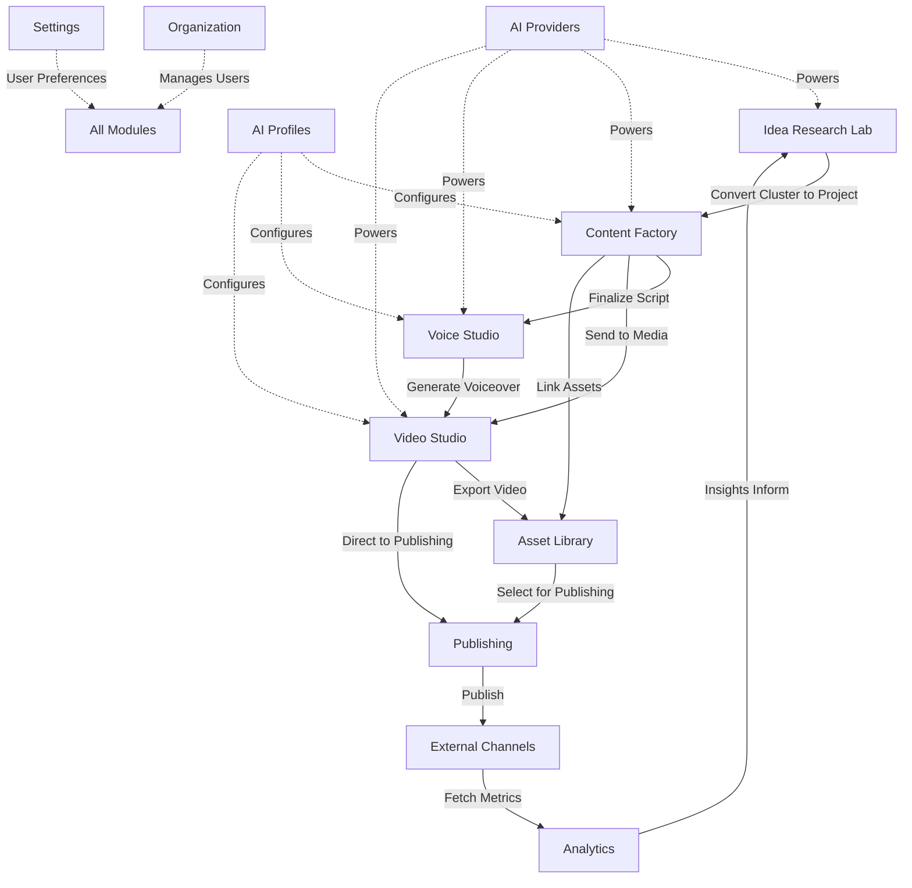

# AICF v2 - Information Architecture

**Version:** 2.0  
**Document Type:** UX/UI Design Specification  
**Status:** Final Draft  
**Last Updated:** 2024  

---

## #1 Product Overview

### What is AICF?

AICF (AI Content Factory) is a comprehensive SaaS platform designed to streamline the entire content creation workflow—from initial idea discovery through research, content planning, media generation (voice/video), and multi-channel publishing. It leverages AI providers to automate and enhance every stage of the content production pipeline.

### Purpose

The primary purpose of AICF is to:

1. **Centralize Content Operations**: Provide a single source of truth for all content-related activities
2. **Accelerate Production**: Reduce time from idea to published content through AI automation
3. **Ensure Consistency**: Maintain brand voice and quality standards across all outputs
4. **Enable Collaboration**: Support team-based workflows with role-based access and approval chains
5. **Measure Impact**: Track performance metrics across all published content

### Target Users

| User Type | Description | Primary Needs |
|-----------|-------------|---------------|
| **Content Strategists** | Plan and oversee content initiatives | Research tools, clustering, editorial calendars |
| **Content Creators** | Write scripts, articles, and copy | Writing assistants, templates, AI profiles |
| **Media Producers** | Generate voiceovers and videos | Voice studio, video studio, asset management |
| **Publishing Managers** | Schedule and distribute content | Multi-channel publishing, scheduling, approvals |
| **Analysts** | Measure content performance | Analytics dashboards, reporting, insights |
| **Administrators** | Manage organization settings | User management, AI provider configuration, billing |

---

## #2 Main Navigation

### Left Sidebar Structure

The navigation follows a workflow-based hierarchy, grouping related functions into logical modules.

```
┌─────────────────────────────────────┐
│  AICF                               │
├─────────────────────────────────────┤
│  📊 Dashboard                       │
├─────────────────────────────────────┤
│  🔍 Discovery                       │
│     └─ Idea Research Lab            │
├─────────────────────────────────────┤
│  📝 Content Factory                 │
│     └─ Projects                     │
│     └─ Scripts                      │
│     └─ Templates                    │
├─────────────────────────────────────┤
│  🎬 Media Studio                    │
│     └─ Voice Studio                 │
│     └─ Video Studio                 │
│     └─ Asset Library                │
├─────────────────────────────────────┤
│  📢 Publishing                      │
│     └─ Channels                     │
│     └─ Scheduler                    │
│     └─ Queue                        │
├─────────────────────────────────────┤
│  📈 Analytics                       │
├─────────────────────────────────────┤
│  ⚙️ Configuration                   │
│     └─ AI Providers                 │
│     └─ AI Profiles                  │
│     └─ Organization                 │
│     └─ Settings                     │
└─────────────────────────────────────┘
```

### Navigation Items (Detailed)

| Section | Label | Icon | Description |
|---------|-------|------|-------------|
| **Dashboard** | Dashboard | `📊` | Central hub with overview widgets, recent activity, quick actions |
| **Discovery** | Idea Research Lab | `🔍` | Market research, trend analysis, topic clustering, opportunity identification |
| **Content Factory** | Content Factory | `📝` | Core content creation workspace including projects, scripts, outlines |
| **Media Studio** | Media Studio | `🎬` | Parent section for voice, video, and asset management |
| ↳ Voice Studio | Voice Studio | `🎙️` | Text-to-speech generation, voice cloning, audio editing |
| ↳ Video Studio | Video Studio | `🎥` | Video generation, scene composition, animation |
| ↳ Asset Library | Asset Library | `📁` | Centralized media storage, brand assets, templates |
| **Publishing** | Publishing | `📢` | Multi-channel distribution, scheduling, queue management |
| **Analytics** | Analytics | `📈` | Performance metrics, engagement tracking, ROI reports |
| **Configuration** | AI Providers | `⚙️` | API key management, provider selection, usage monitoring |
| ↳ AI Profiles | AI Profiles | `🤖` | Custom AI personas, prompt templates, behavior configurations |
| ↳ Organization | Organization | `🏢` | Team management, roles, permissions, billing |
| ↳ Settings | Settings | `🔧` | User preferences, notifications, integrations |

---

## #3 Each Module

### 3.1 Dashboard

**Purpose:** Provide an at-a-glance overview of all content operations, surface actionable items, and enable quick navigation to frequently used features.

**Primary Users:** All user types (role-based widget visibility)

**Main Actions:**
- View content pipeline status
- Access recent projects
- Monitor publishing queue
- Check AI credit usage
- Create new research/project (quick action)
- Review notifications

**Expected Outputs:**
- Personalized dashboard widgets
- Activity feed
- Quick stats cards
- Upcoming deadlines calendar

---

### 3.2 Idea Research Lab

**Purpose:** Enable data-driven content ideation through market research, trend analysis, and AI-powered topic clustering.

**Primary Users:** Content Strategists, Content Creators

**Main Actions:**
- Initiate new research queries
- Analyze search trends and competition
- Cluster related topics
- Evaluate content opportunities (score/rank)
- Convert research clusters into projects
- Save research snapshots

**Expected Outputs:**
- Research reports with insights
- Topic cluster visualizations
- Opportunity scores
- Exportable research data
- Project briefs generated from research

---

### 3.3 Content Factory

**Purpose:** Central workspace for creating, organizing, and managing all content assets from outline to final script.

**Primary Users:** Content Creators, Content Strategists

**Main Actions:**
- Create new content projects
- Develop scripts and outlines
- Apply AI profiles for tone/style
- Collaborate with team members (comments, revisions)
- Version control content
- Link to media assets
- Submit for approval

**Expected Outputs:**
- Structured content projects
- Finalized scripts
- Content outlines
- Revision history
- Approval workflows

---

### 3.4 Voice Studio

**Purpose:** Generate high-quality voiceovers using AI text-to-speech with customization options.

**Primary Users:** Media Producers, Content Creators

**Main Actions:**
- Select or clone voice profiles
- Input script text
- Adjust speech parameters (speed, pitch, emotion)
- Preview audio generations
- Edit and trim audio segments
- Export audio files
- Manage voice library

**Expected Outputs:**
- Generated audio files (MP3, WAV)
- Voice profile configurations
- Audio project files
- Batch generation queues

---

### 3.5 Video Studio

**Purpose:** Create engaging video content using AI-generated visuals, animations, and scene compositions.

**Primary Users:** Media Producers

**Main Actions:**
- Choose video templates/styles
- Import scripts for auto-scene generation
- Customize scenes (visuals, transitions, text overlays)
- Sync with voiceover audio
- Preview video renders
- Adjust timing and pacing
- Export final videos

**Expected Outputs:**
- Rendered video files (MP4, MOV)
- Scene compositions
- Video project files
- Thumbnail images

---

### 3.6 Asset Library

**Purpose:** Centralized repository for all media assets, brand elements, and reusable components.

**Primary Users:** All users (read/write based on permissions)

**Main Actions:**
- Upload and organize assets
- Tag and categorize files
- Search and filter assets
- Set usage permissions
- Create asset collections
- Link assets to projects

**Expected Outputs:**
- Organized asset folders
- Metadata-tagged files
- Shared collections
- Usage analytics per asset

---

### 3.7 Publishing

**Purpose:** Manage multi-channel content distribution, scheduling, and publication workflows.

**Primary Users:** Publishing Managers

**Main Actions:**
- Connect publishing channels (YouTube, social, blogs)
- Schedule content releases
- Manage publishing queue
- Configure channel-specific formatting
- Set up approval gates
- Monitor publication status
- Handle failures/retries

**Expected Outputs:**
- Publishing schedules (calendar view)
- Queue status dashboard
- Publication logs
- Channel configuration profiles
- Error reports

---

### 3.8 Analytics

**Purpose:** Track and measure content performance across all channels to inform strategy and optimization.

**Primary Users:** Analysts, Content Strategists

**Main Actions:**
- View performance dashboards
- Filter by date range, channel, content type
- Compare content performance
- Generate custom reports
- Set up automated report delivery
- Export data for external analysis

**Expected Outputs:**
- Interactive charts and graphs
- Performance scorecards
- Trend analyses
- downloadable reports (PDF, CSV)
- ROI calculations

---

### 3.9 AI Providers

**Purpose:** Configure and manage connections to external AI service providers.

**Primary Users:** Administrators

**Main Actions:**
- Add/remove AI provider API keys
- Set default providers per feature
- Monitor usage and costs
- Configure rate limits
- Test provider connections

**Expected Outputs:**
- Provider connection status
- Usage dashboards
- Cost tracking reports
- Provider health checks

---

### 3.10 AI Profiles

**Purpose:** Define reusable AI personas and behavior configurations for consistent content generation.

**Primary Users:** Content Strategists, Administrators

**Main Actions:**
- Create new AI profiles
- Define personality traits and tone
- Write system prompts
- Test profile outputs
- Assign profiles to projects/users
- Version profile changes

**Expected Outputs:**
- AI profile library
- Profile preview outputs
- Usage statistics per profile
- Profile export/import files

---

### 3.11 Organization

**Purpose:** Manage team structure, user roles, permissions, and organizational settings.

**Primary Users:** Administrators

**Main Actions:**
- Invite/remove team members
- Assign roles and permissions
- Create user groups
- Manage subscription/billing
- View audit logs
- Configure SSO (if applicable)

**Expected Outputs:**
- User directory
- Role permission matrix
- Billing statements
- Audit trail reports

---

### 3.12 Settings

**Purpose:** Configure user-specific preferences and application-wide settings.

**Primary Users:** All users (scope varies by setting)

**Main Actions:**
- Update profile information
- Configure notification preferences
- Set timezone and language
- Manage connected accounts
- Configure keyboard shortcuts
- Reset application state

**Expected Outputs:**
- Saved user preferences
- Notification configuration
- Integration status

---

## #4 Page Tree

Complete page hierarchy for AICF v2:

```
Dashboard
├── Dashboard Overview
│   ├── Widgets: Pipeline Status
│   ├── Widgets: Recent Activity
│   ├── Widgets: Quick Stats
│   ├── Widgets: Upcoming Deadlines
│   └── Widgets: AI Credit Usage
│
Idea Research Lab
├── Research Dashboard
│   ├── Recent Researches
│   └── Saved Snapshots
├── New Research
│   ├── Query Builder
│   ├── Parameter Configuration
│   └── Launch Research
├── Research Results
│   ├── Results Summary
│   ├── Trend Analysis
│   └── Competition Overview
├── Clusters
│   ├── Cluster List
│   └── Cluster Detail
│       ├── Topics in Cluster
│       ├── Opportunity Score
│       └── Convert to Project
└── Episode Detail
    ├── Full Research Report
    ├── Export Options
    └── Share/Collaborate
│
Content Factory
├── Projects Dashboard
│   ├── Active Projects
│   ├── Archived Projects
│   └── Project Templates
├── New Project
│   ├── Project Brief
│   ├── Content Type Selection
│   ├── AI Profile Assignment
│   └── Team Assignment
├── Project Detail
│   ├── Overview Tab
│   ├── Outline Editor
│   ├── Script Editor
│   ├── Assets Tab
│   ├── Comments/Reviews
│   ├── Version History
│   └── Approval Workflow
├── Scripts Library
│   ├── All Scripts
│   ├── By Status (Draft, Review, Approved)
│   └── Script Detail
└── Templates
    ├── Template Gallery
    ├── Create Template
    └── Template Editor
│
Media Studio
├── Voice Studio
│   ├── Voice Dashboard
│   │   ├── Recent Generations
│   │   └── Quick Generate
│   ├── Voice Library
│   │   ├── Available Voices
│   │   ├── Cloned Voices
│   │   └── Voice Detail
│   ├── New Generation
│   │   ├── Script Input
│   │   ├── Voice Selection
│   │   ├── Parameter Tuning
│   │   ├── Preview
│   │   └── Generate & Export
│   └── Audio Editor
│       ├── Timeline View
│       ├── Trim/Edit Tools
│       └── Export Options
│
├── Video Studio
│   ├── Video Dashboard
│   │   ├── Recent Videos
│   │   └── Quick Create
│   ├── Templates Gallery
│   │   ├── Browse Templates
│   │   └── Template Preview
│   ├── New Video Project
│   │   ├── Template Selection
│   │   ├── Script Import
│   │   ├── Auto-Scene Generation
│   │   └── Project Setup
│   ├── Video Editor
│   │   ├── Scene Timeline
│   │   ├── Visual Customization
│   │   ├── Text Overlays
│   │   ├── Transitions
│   │   ├── Audio Sync
│   │   ├── Preview Render
│   │   └── Export Settings
│   └── Video Library
│       ├── All Videos
│       ├── By Status
│       └── Video Detail
│
└── Asset Library
    ├── All Assets
    ├── Folders
    │   ├── Brand Assets
    │   ├── Music
    │   ├── Images
    │   └── Documents
    ├── Upload Modal
    ├── Asset Detail
    │   ├── Preview
    │   ├── Metadata
    │   ├── Usage History
    │   └── Permissions
    └── Collections
        ├── Create Collection
        └── Collection Detail
│
Publishing
├── Publishing Dashboard
│   ├── Queue Overview
│   ├── Upcoming Schedule
│   └── Recent Publications
├── Channels
│   ├── Channel List
│   ├── Add New Channel
│   │   ├── Platform Selection
│   │   ├── Authentication
│   │   └── Configuration
│   └── Channel Detail
│       ├── Settings
│       ├── Content Format Rules
│       └── Publication History
├── Scheduler
│   ├── Calendar View
│   ├── Create Scheduled Post
│   │   ├── Content Selection
│   │   ├── Channel Selection
│   │   ├── Date/Time Picker
│   │   └── Confirmation
│   └── Bulk Schedule
├── Queue
│   ├── Pending Items
│   ├── In Progress
│   ├── Failed Items
│   └── Retry/Cancel Actions
└── Publication Logs
    ├── All Publications
    ├── Filter by Channel/Date
    └── Log Detail
│
Analytics
├── Analytics Dashboard
│   ├── Overview Metrics
│   ├── Performance Trends
│   └── Top Performing Content
├── Content Performance
│   ├── Filter Controls
│   ├── Performance Table
│   └── Content Detail Drill-down
├── Channel Analytics
│   ├── By Channel Comparison
│   └── Channel Detail
├── Custom Reports
│   ├── Report Builder
│   ├── Saved Reports
│   └── Schedule Delivery
└── Data Export
    ├── Export Wizard
    └── Download History
│
AI Providers
├── Providers Dashboard
│   ├── Connected Providers
│   └── Usage Summary
├── Add Provider
│   ├── Provider Selection
│   ├── API Key Input
│   └── Connection Test
├── Provider Detail
│   ├── Configuration
│   ├── Usage Statistics
│   ├── Cost Tracking
│   └── Health Status
└── Usage Reports
    ├── By Provider
    ├── By Feature
    └── Cost Analysis
│
AI Profiles
├── Profiles Library
│   ├── All Profiles
│   ├── By Category
│   └── Favorites
├── Create Profile
│   ├── Basic Info
│   ├── Personality Traits
│   ├── System Prompt Editor
│   ├── Example Outputs
│   └── Save Profile
├── Profile Detail
│   ├── Configuration View
│   ├── Test Interface
│   ├── Usage History
│   └── Version History
└── Profile Marketplace (Future)
    ├── Browse Community Profiles
    └── Import Profile
│
Organization
├── Team Overview
│   ├── Member List
│   └── Invitations Pending
├── Add Member
│   ├── Email Invitation
│   ├── Role Assignment
│   └── Send Invite
├── Member Detail
│   ├── Profile Info
│   ├── Role & Permissions
│   ├── Activity Log
│   └── Deactivate/Remove
├── Roles & Permissions
│   ├── Role List
│   ├── Create Custom Role
│   └── Permission Matrix
├── Groups
│   ├── Group List
│   ├── Create Group
│   └── Group Members
├── Billing
│   ├── Subscription Plan
│   ├── Payment Methods
│   ├── Invoice History
│   └── Upgrade/Downgrade
└── Audit Logs
    ├── All Events
    ├── Filter by User/Action
    └── Event Detail
│
Settings
├── Profile Settings
│   ├── Personal Info
│   ├── Avatar Upload
│   └── Password Change
├── Notification Preferences
│   ├── Email Notifications
│   ├── In-App Notifications
│   └── Digest Frequency
├── Regional Settings
│   ├── Timezone
│   ├── Language
│   └── Date Format
├── Integrations
│   ├── Connected Services
│   ├── Add Integration
│   └── Configure Integration
├── Keyboard Shortcuts
│   ├── Shortcut Reference
│   └── Custom Shortcuts
└── Advanced
    ├── Clear Cache
    ├── Reset Preferences
    └── Account Deletion
```

---

## #5 Relationships

### Module Flow Diagram

The following diagram illustrates how modules connect in the typical content creation workflow:



### Relationship Descriptions

#### Idea Research Lab → Content Factory
- **Trigger:** User converts a research cluster into a content project
- **Data Transfer:** Research insights, topic keywords, opportunity scores become project brief
- **Navigation:** "Create Project" button on Cluster Detail page routes to New Project form with pre-filled data

#### Content Factory → Voice Studio
- **Trigger:** User requests voiceover generation from script
- **Data Transfer:** Script text sent to Voice Studio as input
- **Navigation:** "Generate Voiceover" action opens Voice Studio with script pre-loaded

#### Content Factory → Video Studio
- **Trigger:** User initiates video creation from project
- **Data Transfer:** Script, outline, selected assets transferred
- **Navigation:** "Create Video" button routes to Video Studio New Project flow

#### Voice Studio → Video Studio
- **Trigger:** User adds generated voiceover to video project
- **Data Transfer:** Audio file reference shared between studios
- **Navigation:** "Use in Video" action from Voice Studio opens Video Editor with audio synced

#### Voice/Video Studio → Asset Library
- **Trigger:** User saves generated media or uploads new assets
- **Data Transfer:** File storage with metadata tagging
- **Navigation:** Automatic save to library; manual upload via Asset Library interface

#### Media Studio → Publishing
- **Trigger:** User schedules or publishes finished content
- **Data Transfer:** Final media files, metadata, channel-specific formatting
- **Navigation:** "Publish" button opens Publishing Scheduler with content pre-selected

#### Publishing → Analytics
- **Trigger:** Automated data collection post-publication
- **Data Transfer:** Performance metrics pulled from external channels
- **Navigation:** Click any published item in Publishing to view its Analytics detail

#### Analytics → Idea Research Lab
- **Trigger:** Insights from performance data inform new research directions
- **Data Transfer:** Top-performing topics, engagement patterns
- **Navigation:** "Research Similar Topics" link from Analytics to Idea Research Lab

#### AI Providers → All Creative Modules
- **Relationship:** Infrastructure dependency
- **Configuration:** Set in AI Providers module, applied throughout app
- **Fallback:** Default provider used if not specified per feature

#### AI Profiles → Content Factory/Voice/Video
- **Relationship:** Configuration inheritance
- **Application:** Selected AI profile determines tone, style, output format
- **Override:** Per-project profile selection overrides default

---

## #6 Navigation Principles

### 6.1 General Navigation Philosophy

AICF follows a **workflow-centric navigation model** where users progress through logical stages of content creation. The design prioritizes:

1. **Progressive Disclosure**: Show only relevant options based on current context
2. **Minimal Clicks**: Critical actions accessible within 2 clicks from any page
3. **Clear Orientation**: Users always know where they are and how to proceed
4. **Flexible Paths**: Support both linear workflows and non-linear exploration

---

### 6.2 Movement Patterns

#### Horizontal Navigation (Left Sidebar)
- **Purpose:** Switch between major modules
- **Behavior:** Persistent across all pages; collapses to icons-only on small screens
- **Active State:** Highlighted background + accent color indicator
- **Expansion:** Sub-items expand inline (accordion style) when parent clicked

#### Vertical Navigation (Within Modules)
- **Purpose:** Navigate pages within a module
- **Implementation:** Secondary navigation bar or tabs below main header
- **Example:** Content Factory module shows "Projects | Scripts | Templates" tabs

#### Breadcrumbs
- **Location:** Below main header, above page content
- **Format:** `Module > Parent Page > Current Page`
- **Interactivity:** All segments except current page are clickable links
- **Truncation:** Long paths show first + last segments with ellipsis (`Module > ... > Current`)
- **Example:** `Content Factory > Projects > Project Alpha > Script Editor`

#### Back Buttons
- **Placement:** Top-left of content area, before page title
- **Visibility:** Shown when:
  - Navigating deeper than 2 levels in hierarchy
  - Arriving from a different module
  - Completing a multi-step wizard
- **Behavior:** Returns to immediate previous page (browser history aware)
- **Label:** Contextual when helpful ("Back to Projects", "Back to Editor")

---

### 6.3 Tab Usage Guidelines

Tabs are used in the following scenarios:

#### When to Use Tabs
1. **Related Content Views**: Different perspectives on same entity
   - Example: Project Detail → Overview | Script | Assets | Comments
   
2. **Editor Modes**: Switching between edit/preview/configuration
   - Example: Video Editor → Timeline | Preview | Settings

3. **Filter Categories**: Mutually exclusive content groupings
   - Example: Scripts Library → All | Draft | In Review | Approved

4. **Multi-Step Forms**: Progress indication through complex workflows
   - Example: New Project → Brief | Content | Team | Review

#### When NOT to Use Tabs
- Navigation between unrelated pages (use sidebar instead)
- When more than 7 tabs would be required (consider dropdown or separate pages)
- For actions that trigger modal dialogs

---

### 6.4 Modal vs. Page Navigation

#### Use Modals For:
- Quick actions (Create, Delete, Share)
- Multi-step wizards under 5 steps
- Confirmation dialogs
- Preview overlays
- Inline editing of simple fields

#### Use Full Pages For:
- Complex editors (Script Editor, Video Editor)
- Detail views with extensive content
- Settings and configuration pages
- Analytics and reporting dashboards
- Any page requiring focused attention

---

### 6.5 Search & Global Actions

#### Global Search
- **Location:** Top header, center-aligned
- **Scope:** Searches across all modules (projects, scripts, assets, research)
- **Behavior:** Typeahead suggestions; Enter navigates to search results page
- **Filters:** Refine by content type, date, status after initial search

#### Global Actions Menu (+ Button)
- **Location:** Top header, right side
- **Contents:** Quick access to most common creation actions
  - New Research
  - New Project
  - New Voice Generation
  - New Video
  - Schedule Post
- **Behavior:** Dropdown menu; keyboard shortcut accessible (`Ctrl/Cmd + N`)

---

### 6.6 Responsive Behavior

| Screen Size | Navigation Adaptation |
|-------------|----------------------|
| **Desktop (>1200px)** | Full sidebar expanded, breadcrumbs visible, all columns shown |
| **Tablet (768-1199px)** | Sidebar collapses to icons, secondary nav becomes scrollable tabs |
| **Mobile (<768px)** | Hamburger menu for sidebar, bottom tab bar for primary modules, stacked layouts |

---

### 6.7 Keyboard Navigation

- **Tab Order:** Logical left-to-right, top-to-bottom flow
- **Shortcuts:**
  - `Ctrl/Cmd + K`: Open global search
  - `Ctrl/Cmd + N`: New item (context-aware)
  - `Ctrl/Cmd + S`: Save current work
  - `Escape`: Close modals, deselect
  - `Arrow Keys`: Navigate lists and grids
  - `Enter`: Activate selected item
- **Focus Indicators:** High-contrast outlines for accessibility

---

## #7 Future Expansion

### Reserved Navigation Slots

The following modules are planned for future releases and have reserved positions in the architecture:

```
┌─────────────────────────────────────┐
│  [Reserved] AI Training             │
│  [Reserved] Collaboration Hub       │
│  [Reserved] Marketplace             │
│  [Reserved] API & Webhooks          │
└─────────────────────────────────────┘
```

---

### 7.1 AI Training Module (Planned v2.5)

**Purpose:** Allow organizations to fine-tune AI models on their proprietary content and brand guidelines.

**Anticipated Features:**
- Upload training datasets
- Monitor training progress
- Test custom model outputs
- Deploy trained models to AI Profiles
- Version control for models

**Integration Points:**
- AI Profiles (deploy custom models)
- Content Factory (use fine-tuned models)
- Asset Library (source training data)

---

### 7.2 Collaboration Hub (Planned v2.3)

**Purpose:** Enhanced real-time collaboration features for distributed teams.

**Anticipated Features:**
- Live co-editing (scripts, projects)
- Video conferencing integration
- Task assignments and tracking
- Meeting notes linked to projects
- Activity feeds and mentions

**Integration Points:**
- Content Factory (co-authoring)
- Organization (team management)
- Notifications (mentions, assignments)

---

### 7.3 Marketplace (Planned v3.0)

**Purpose:** Community-driven marketplace for templates, AI profiles, voices, and plugins.

**Anticipated Features:**
- Browse and purchase community creations
- Sell original templates/profiles
- Rating and review system
- Creator profiles and portfolios
- Revenue sharing dashboard

**Integration Points:**
- AI Profiles (import community profiles)
- Content Factory (purchase templates)
- Voice Studio (buy premium voices)
- Billing (marketplace transactions)

---

### 7.4 API & Webhooks (Planned v2.4)

**Purpose:** Enable programmatic access and third-party integrations.

**Anticipated Features:**
- API key management
- Endpoint documentation
- Webhook configuration
- Usage monitoring
- Integration templates (Zapier, Make, etc.)

**Integration Points:**
- Organization (access control)
- All modules (trigger actions via API)
- Analytics (export data streams)

---

### 7.5 Additional Planned Enhancements

| Feature | Target Version | Description |
|---------|---------------|-------------|
| **Multi-Language Support** | v2.2 | Full UI translation + content localization workflows |
| **Advanced Approvals** | v2.3 | Multi-stage approval chains with conditional routing |
| **White Labeling** | v3.0 | Custom branding for agency/enterprise clients |
| **Mobile Apps** | v3.0 | Native iOS/Android apps for key workflows |
| **Offline Mode** | v2.5 | Limited functionality when disconnected |
| **SSO/SAML** | v2.3 | Enterprise authentication integration |
| **Custom Fields** | v2.4 | User-defined metadata for projects and assets |

---

### 7.6 Scalability Considerations

The information architecture is designed to accommodate:

1. **Horizontal Scaling**: New modules can be added without restructuring existing navigation
2. **Vertical Depth**: Each module supports unlimited nesting of sub-pages where needed
3. **Role Expansion**: New user roles can be defined in Organization without UI changes
4. **Provider Agnostic**: AI Providers module abstracts underlying services for easy swapping
5. **Channel Growth**: Publishing module supports unlimited channel additions

---

### 7.7 Deprecation Strategy

When features are deprecated in future versions:

1. **Soft Deprecation**: Mark as "Legacy" in UI with migration path messaging
2. **Grace Period**: Maintain functionality for 2 minor versions minimum
3. **Redirect Mapping**: Old URLs redirect to replacement features
4. **Documentation Updates**: Changelog and migration guides published
5. **API Versioning**: Maintain backward-compatible API versions

---

## Appendix A: Glossary

| Term | Definition |
|------|------------|
| **Cluster** | A grouped set of related topics identified during research |
| **AI Profile** | A configured AI persona with specific tone, style, and behavior |
| **Project** | A container for all assets related to a single content piece |
| **Channel** | A destination platform for publishing (YouTube, blog, social, etc.) |
| **Voice Clone** | A custom AI voice modeled after a specific speaker |
| **Scene** | A single segment within a video composition |
| **Asset** | Any media file (audio, video, image, document) stored in the library |
| **Queue** | The list of content waiting to be published |
| **Snapshot** | A saved point-in-time copy of research results |

---

## Appendix B: Document Revision History

| Version | Date | Author | Changes |
|---------|------|--------|---------|
| 1.0 | 2024-01-15 | UX Team | Initial draft |
| 1.1 | 2024-01-20 | UX Team | Added page tree detail |
| 2.0 | 2024-01-25 | UX Team | Final review, added Mermaid diagrams |

---

*End of Document*
